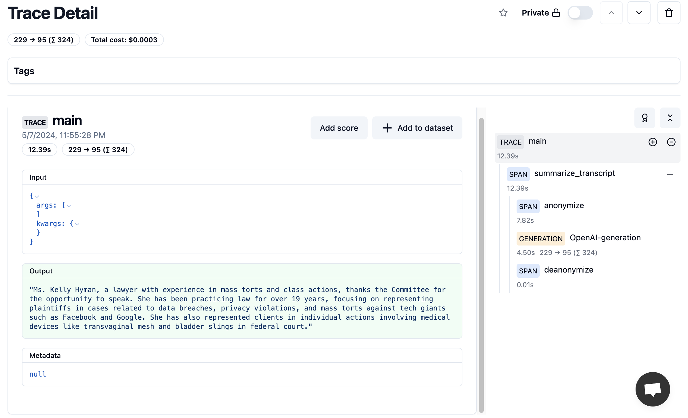

# Security with Langfuse

There are a host of potential security risks involved with LLM-based applications, such as prompt injection, personally identifiable information (PII), or harmful prompts. Langfuse provides a comprehensive and easy way to monitor and protect against these security risks.

This document will provide an overview of how Langfuse can be used with security tools. In the example below we use a [LLM Guard](https://llm-guard.com/), but there are many open-source and/or paid security tools available, such as Prompt Armor, Microsoft Azure Responsible AI, and Lakera Guard.

## Overview

Short video here?

## How Can Langfuse Help Mitigate Security Risks?

1. Catching and blocking a potentially harmful or inappropriate prompt before sending to the model
2. Redacting sensitive PII before being sending into the model and then un-redacting in the response
3. Evaluating prompts and completions in Langfuse based on qualities like toxicity, relevance, or sensitive material.

## Example: Personally Identifiable Information

Personally Identifiable Information (PII) includes:

- Credit card number
- Full name
- Phone number
- Email address
- Social Security number
- IP Address

Exposing PII to LLMs can pose serious security and privacy risks, such as violating contractual obligations or regulatory compliance requirements, or mitigating the risks of data leakage or a data breach.

The example below shows a simple application that summarizes a given court transcript. For privacy reasons, the application wants to anonymize PII before the information is fed into the model, and then un-redact the response to produce a coherent summary.

### Installation & Setup

```sh
pip install llm-guard langfuse openai
```

### Use Anonymize and Deanonymize

We break up each step of the process into its own function so we can track each step separately in Langfuse.

```python
from llm_guard.input_scanners import Anonymize
from llm_guard.vault import Vault
from llm_guard.input_scanners.anonymize_helpers import BERT_LARGE_NER_CONF
from langfuse.decorators import observe, langfuse_context
from langfuse.openai import openai # OpenAI integration
from llm_guard.output_scanners import Deanonymize

vault = Vault()

prompt = """
Plaintiff, Jane Doe, by and through her attorneys, files this complaint against Defendant, Big Corporation, and alleges upon information and belief, except for those allegations pertaining to personal knowledge, that on or about July 15, 2023, at the Defendant's manufacturing facility located at 123 Industrial Way, Springfield, Illinois, Defendant negligently failed to maintain safe working conditions, leading to Plaintiff suffering severe and permanent injuries. As a direct and proximate result of Defendant's negligence, Plaintiff has endured significant physical pain, emotional distress, and financial hardship due to medical expenses and loss of income. Plaintiff seeks compensatory damages, punitive damages, and any other relief the Court deems just and proper."""

@observe()
def anonymize(input: str):
  scanner = Anonymize(vault, preamble="Insert before prompt", allowed_names=[], hidden_names=["Test LLC"],
                    recognizer_conf=BERT_LARGE_NER_CONF, language="en")
  sanitized_prompt, is_valid, risk_score = scanner.scan(prompt)
  return sanitized_prompt

@observe()
def deanonymize(sanitized_prompt: str, answer: str):
  scanner = Deanonymize(vault)
  sanitized_model_output, is_valid, risk_score = scanner.scan(sanitized_prompt, answer)

  return sanitized_model_output

@observe()
def summarize_transcript(prompt: str):
  sanitized_prompt = anonymize(prompt)

  answer = openai.chat.completions.create(
        model="gpt-3.5-turbo",
        max_tokens=100,
        messages=[
          {"role": "system", "content": "Summarize the given court transcript."},
          {"role": "user", "content": sanitized_prompt}
        ],
    ).choices[0].message.content

  sanitized_model_output = deanonymize(sanitized_prompt, answer)

  return sanitized_model_output

@observe()
def main():
    return summarize_transcript(prompt)

main()
```


<Callout type="info">
  See the trace generated from this example. You can track each step--Anonymize, Summarize, and Deanonymize-- separately: https://cloud.langfuse.com/project/clvh71wlt0000wpuqhferayy5/traces/d31a6a8a-03b4-4487-8d87-40c3a68464a5?observation=aa28105d-c33e-4333-828a-d916de48e387
</Callout>


## Advanced Usage

### Langfuse Model-Based Evaluations

You can use a security tool like LLM Guard to scan model prompts and completions, and then use Langfuse to track and evaluate this data after the call is executed.

One way is to understand which flags (toxicity, bias, relevance) are set off the most, which can help teams identify which security risks are most pressing and build more robust tools against those specific issues.

Another way is to monitor the latency and accuracy of different security tools. Langfuse allows users to see how much time each step the security process takes. Another way Langfuse can be used is allowing users to monitor the risk scores returned by certain scanners and using that information to calibrate the sensitivity of their models and fine-tune their models to protect against known security risks.

INSERT IMAGE OR VIDEO HERE