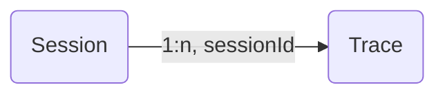

# Sessions

Many interactions with LLM applications span multiple traces. `Sessions` in Langfuse are a way to group these traces together and see a simple **session replay** of the entire interaction. Get started by adding a `sessionId` when creating a trace.

Try this feature using the public [example project](/docs/demo).

_Example session spanning multiple traces_

<Frame border fullWidth>
  
</Frame>

## How it works



Add a `sessionId` when creating/updating a trace. This can be any string that you use to identify the session. All traces with the same `sessionId` will be grouped together.

<Tabs items={["Python", "JS/TS", "OpenAI", "Langchain (Python)", "Langchain (JS/TS)"]}>
<Tab>
```diff
langfuse.trace(
    ...
+   session_id="your-session-id"
)
```

</Tab>
<Tab>
```diff
langfuse.trace({
    ...
+   sessionId: "your-session-id"
})
```

</Tab>
<Tab>
```
from langfuse.openai import openai
```
```diff
completion = openai.chat.completions.create(
    name="test-chat",
    model="gpt-3.5-turbo",
    messages=[
        {"role": "system", "content": "You are a calculator."},
        {"role": "user", "content": "1 + 1 = "}],
    temperature=0,
+   session_id="your-session-id"
)
````

</Tab>
<Tab>
```diff
handler = CallbackHandler(
+   session_id="your-session-id"
)
```

</Tab>
<Tab>
```diff
const handler = new CallbackHandler({
+   sessionId: "your-session-id"
});
```

</Tab>

</Tabs>

Session tracking for all [integrations](/docs/integrations) will be available soon. If you want to be notified when this feature is ready, please open an [issue](/issue).

## Other features

- Publish a session to share with others as a public link
- Bookmark a session to easily find it later
- Manually evaluate sessions by adding `scores` from the Langfuse UI
