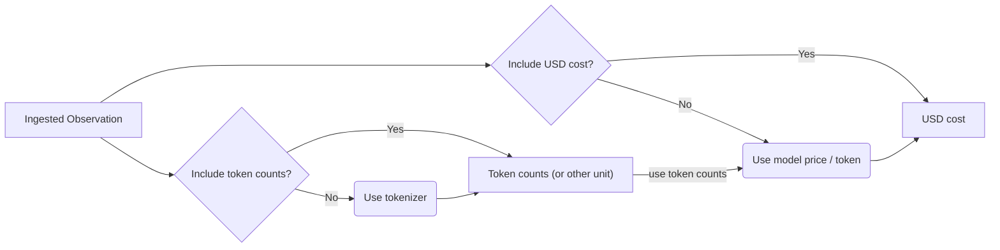

# Ingestion of usage and cost

With Langfuse, you can store model tokens and cost on the Generation. If any of these values are not provided, Langfuse automatically calculates them based on the model name and [Langfuse maintained models](https://cloud.langfuse.com/project/clkk9oh29000umh08077y93lr/models). We regularly update the list of Langfuse maintained models.



Below is an example, of how to track cost and tokens on a Generation. If available in the LLM response, this is the preferred way to track usage with Langfuse.

```typescript
generation = {
  ...
  usage: {
    prompt: number,
    completion: number,
    total: number,
    unit: string, // 'TOKENS' or 'CHARACTERS', defaults to 'TOKENS'
    inputCost: number
    outputCost: number
    totalCost: number
  },
  ...
}
```

Across the Langfuse product including all dashboards and tables, Langfuse will only attempt to calculate tokens or cost, if they were not provided by the user.

### Compatibility with OpenAI

Langfuse is compatible with the usage objects returned by the OpenAI API. The Langfuse SDKs automatically convert the OpenAI usage object to the more generic Langfuse usage object.

```typescript
usage = {
  promptTokens: 50,
  completionTokens: 49,
  totalTokens: 99,
};
```

## Built-in token calculation

For ingested generations without token usage attributes, Langfuse automatically calculates token amounts based on the `model`. Langfuse attempts to match the generation`s model to the [Langfuse maintained models](https://cloud.langfuse.com/project/clkk9oh29000umh08077y93lr/models). Refer to the [docs](/docs/token-usage#model-matching-details) to explore the matching algorithm.

Langfuse uses the tokenizers from the Tokenizer column to calculate token amounts. If tokenizers are missing for your use case, add a [GitHub discussion](https://github.com/langfuse/langfuse/discussions).

The example below will match the `gpt-4-0125-preview` model and Langfuse will calculate token amounts.

```typescript
generation = {
  model='gpt-4-0125-preview'
  usage: undefined,
  input: 'This is a prompt',
  output: 'This is a completion',
}
```

We use the following tokenizer packages to calculate token amounts:

| Tokenizer | Package                                                                            |
| --------- | ---------------------------------------------------------------------------------- | --- |
| `openai`  | [`tiktoken`](https://www.npmjs.com/package/tiktoken)                               |     |
| `claude`  | [`@anthropic-ai/tokenizer`](https://www.npmjs.com/package/@anthropic-ai/tokenizer) |

## Built-in cost calculation

For ingested generations without costs in the usage attributes, Langfuse automatically calculates model cost. Langfuse attempts to match the generation`s model to the [Langfuse maintained models](https://cloud.langfuse.com/project/clkk9oh29000umh08077y93lr/models). Refer to the [docs](/docs/token-usage#model-matching-details) to explore the matching algorithm. We regularly update the list of Langfuse maintained models.

You can also create your own model definition in the models table. This way, you can personalise matching patterns, prices, and more for your use case.

<Frame></Frame>

## Model matching details

Langfuse attempts to match as many models as possible to the [Langfuse maintained models](https://cloud.langfuse.com/project/clkk9oh29000umh08077y93lr/models).

The following parameters of the Generations are used to match models stored in Langfuse:

- `model`: is used to match the `Match Pattern` of the models using regular expressions (e.g. `gpt-4-0125-preview` will match `(?i)^(gpt-4-0125-preview)$`)
- `project_id` (set automatically by Langfuse): if the user decided to create own models, we will automatically prioritize the models with the same `project_id` over the Langfuse maintained models
- `unit`: the unit on the usage object of the generation (e.g. `TOKENS` or `CHARACTERS`) has to match the `unit` on the Model
- `start_time`: has to be larger than the models `Start Date` timestamp or it will defailt to the model without `Start Date`
