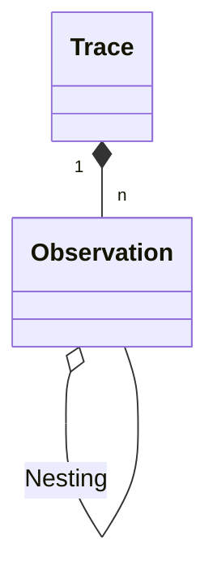
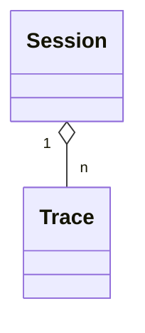

# Tracing Data Model

[Tracing](/docs/tracing) in Langfuse is a way to log and analyze the execution of your LLM applications. The following reference provides a detailed overview of the data model used. It is inspired by OpenTelemetry.

## Traces and Observations

A `trace` typically represents a single request or operation.
It contains the overall input and output of the function, as well as metadata about the request ( i.e. user, session, tags, etc.).

Each trace can contain multiple `observations` to log the individual steps of the execution. Usually, a trace corresponds to a single api call of an application.

import { CircleDot, MoveHorizontal, Fan, ListTree } from "lucide-react";

### Observation types

- <CircleDot size={16} className="text-muted-green inline mr-1" /> `Events` are the
  basic building blocks. They are used to track discrete events in a trace.
- <MoveHorizontal size={16} className="text-muted-blue inline mr-1" /> `Spans` represent
  durations of units of work in a trace.
- <Fan size={16} className="text-muted-magenta inline mr-1" /> `Generations` are
  spans used to log generations of AI models incl. prompts, [token usage and costs](/docs/model-usage-and-cost).

### Observation nesting

Hierarchical structure of traces in Langfuse

Example trace in Langfuse UI

Example trace in Langfuse UI

## Sessions

Optionally, traces can be grouped into [sessions](/docs/tracing-features/sessions).
Sessions are used to group traces that are part of the same user interaction.
A common example is a thread in a chat interface.

Please refer to the [Sessions](/docs/tracing-features/sessions) documentation to add sessions to your traces.

Optionally, sessions aggregate traces

Example session in Langfuse UI

<Frame border fullWidth>
  
</Frame>

## Scores

[Scores](/docs/scores) are flexible objects used to evaluate traces, observations, sessions and dataset runs.

They can be:

- Numeric, categorical, or boolean values
- Associated with a trace, a session, or a dataset run (one and only one is required)
- For trace level scores only: Linked to a specific observation within a trace (optional)
- Annotated with comments for additional context
- Validated against a score configuration schema (optional)

Typically, session-level scores are used for comprehensive evaluation of conversational experiences across multiple interactions, while trace-level scores are used for evaluation of a single interaction. Dataset run level scores are used for overall evaluation of a dataset run, e.g. precision, recall, F1-score.

Please refer to the [scores documentation](/docs/scores) to get started. For more details on score types and attributes, refer to the [score data model](/docs/scores/data-model) documentation.

## Billable Units

Langfuse Cloud [pricing](/pricing) is based on the number of ingested units per billing period.

`Units` = `Traces` + `Observations` + `Scores`

Use our [pricing calculator](/pricing?calculatorOpen=true) to estimate your monthly costs based on your expected usage.

### FAQ

**How can I track my Langfuse Cloud usage?** Use the Usage Monitoring Report in the Dashboards tab in Langfuse to analyze your Langfuse Cloud usage.

**How can I optimize my Langfuse Cloud usage to reduce cost?** If your application scales and you want to optimize Langfuse Cloud cost, please check out [this guide](/faq/all/cutting-costs).
