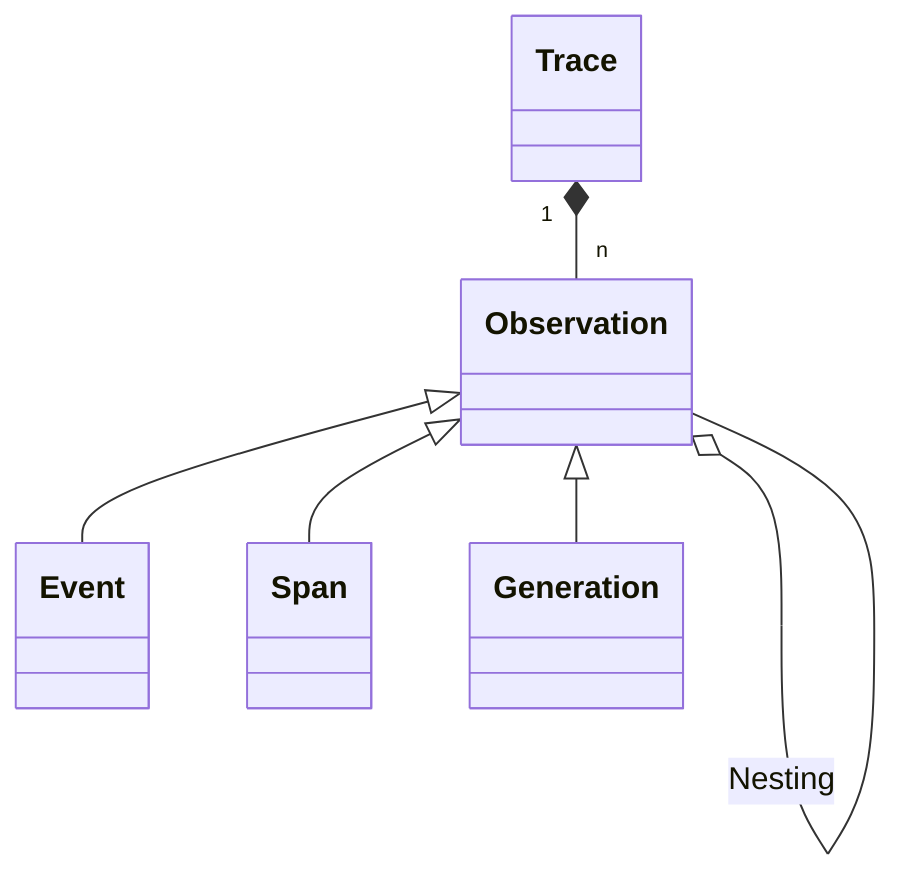
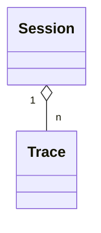
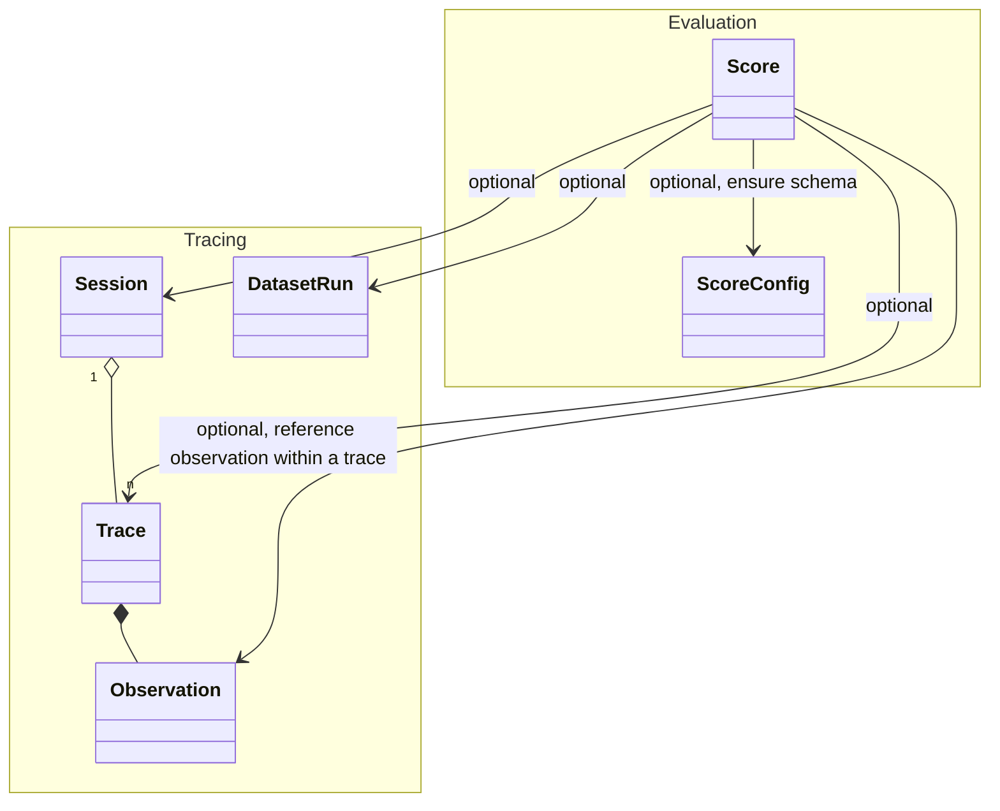

# Tracing Data Model

[Tracing](/docs/tracing) in Langfuse is a way to log and analyze the execution of your LLM applications. The following reference provides a detailed overview of the data model used. It is inspired by OpenTelemetry.

## Traces and Observations

A `trace` typically represents a single request or operation.
It contains the overall input and output of the function, as well as metadata about the request, such as the user, the session, and tags.
Usually, _a trace corresponds to a single api call of an application_.

Each trace can contain multiple `observations` to log the individual steps of the execution.

- Observations are of different types:
  - `Events` are the basic building blocks. They are used to track discrete events in a trace.
  - `Spans` represent durations of units of work in a trace.
  - `Generations` are spans used to log generations of AI models. They contain additional attributes about the model, the prompt, and the completion. For generations, [token usage and costs](/docs/model-usage-and-cost) are automatically calculated.
- Observations can be nested.

**Hierarchical structure of traces in Langfuse**

**Example trace in Langfuse UI**

**Example trace in Langfuse UI**

## Sessions

Optionally, traces can be grouped into [sessions](/docs/tracing-features/sessions).
Sessions are used to group traces that are part of the same user interaction.
A common example is a thread in a chat interface.

Please refer to the [Sessions](/docs/tracing-features/sessions) documentation to add sessions to your traces.

**Optionally, sessions aggregate traces**

**Example session in Langfuse UI**

<Frame border fullWidth>
  
</Frame>

## Scores

Traces, observations, sessions and dataset runs can be evaluated using [scores](/docs/scores). Scores are flexible objects that store evaluation metrics and can be:

- Numeric, categorical, or boolean values
- Associated with a trace, a session, or a dataset run (one and only one is required)
- For trace level scores only: Linked to a specific observation within a trace (optional)
- Annotated with comments for additional context
- Validated against a score configuration schema (optional)

Typically, session-level scores are used for comprehensive evaluation of conversational experiences across multiple interactions, while trace-level scores are used for evaluation of a single interaction. Dataset run level scores are used for overall evaluation of a dataset run, e.g. precision, recall, F1-score.

Please refer to the [scores documentation](/docs/scores) to get started. For more details on score types and attributes, refer to the [score data model](/docs/scores/data-model) documentation.

**Optionally, scores can add evaluation metrics to traces, sessions, and dataset runs**

