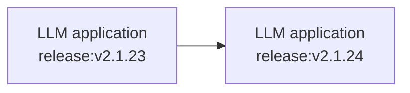
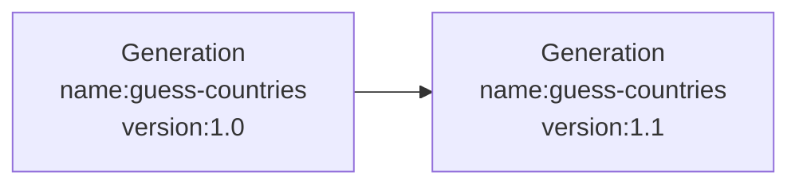

# Releases & Versioning

You can track the effect of changes to your LLM app on metrics in Langfuse. This allows you to:

- **Run experiments (A/B tests)** in production and measure the impact on costs, latencies and quality.
  - _Example_: "What is the impact of switching to a new model?"
- **Explain changes to metrics** over time.
  - _Example:_ "Why did latency in this chain increase?"

## Releases



A `release` tracks the overall version of your application. Commonly it is set to the _semantic version_ or _git commit hash_ of your application.

The SDKs look for a `release` in the following order:

1. SDK initialization
2. Environment variable
3. Automatically on popular platforms

#### SDK initialization

<Tabs items={["Python", "JS/TS", "Langchain (Python)", "Langchain (JS)"]}>

<Tab>

Decorators

```python /release="<release_tag>"/
from langfuse.decorators import langfuse_context, observe

@observe()
def fn():
    langfuse_context.update_current_trace(
        release="<release_tag>"
    )

fn()
```

Low-level SDK

```python /release="<release_tag>"/
from langfuse import Langfuse

langfuse = Langfuse(
  release="<release_tag>"
)
```

</Tab><Tab>

```ts /release: "<release_tag>"/
import { Langfuse } from "langfuse";

langfuse = new Langfuse({
  release: "<release_tag>",
});
```

</Tab><Tab>

```python /release="<release_tag>"/
from langfuse.callback import CallbackHandler

handler = CallbackHandler(release="<release_tag>")
```

</Tab><Tab>

```ts /release: "<release_tag>"/
import { CallbackHandler } from "langfuse-langchain";

const handler = new CallbackHandler({
  release: "<release_tag>",
});
```

</Tab>

</Tabs>

#### Via environment variable

The SDKs will look for a `LANGFUSE_RELEASE` environment variable. Use it to configure the release e.g. in your CI/CD pipeline.

```bash
LANGFUSE_RELEASE = "<release_tag>" # <- github sha or other identifier
```

#### Automatically on popular platforms

If no other `release` is set, the Langfuse SDKs default to a set of known release environment variables.

Supported platforms include: Vercel, Heroku, Netlify. See the full list of support environment variables for [JS/TS](https://github.com/langfuse/langfuse-js/blob/main/langfuse-core/src/release-env.ts) and [Python](https://github.com/langfuse/langfuse-python/blob/main/langfuse/environment.py#L3).

## Versions



The `version` parameter can be added to `traces` and all observation types (`span`, `generation`, `event`). Thereby, you can track the effect of a new `version` on the metrics of an object with a specific `name` using [Langfuse analytics](/docs/analytics).

<Tabs items={["Python", "JS/TS", "Langchain (Python)","Langchain (JS)"]}>
<Tab>

Decorators

```python /version="1.0"/
from langfuse.decorators import langfuse_context, observe

@observe()
def fn():
    # trace level
    langfuse_context.update_current_trace(
        version="1.0",
    )

    # observation level
    langfuse_context.update_current_observation(
        version="1.0",
    )
fn()
```

Low-level SDK

```python /version="1.0"/
langfuse.generation(
  name="guess-countries",
  version="1.0",
)
```

`langfuse.trace()`, `langfuse.span()` and `langfuse.event()` also take an optional `version` parameter.

</Tab><Tab>

```ts /version: "1.0"/
langfuse.generation({
  name: "guess-countries",
  version: "1.0",
});
```

`langfuse.trace()`, `langfuse.span()` and `langfuse.event()` also take an optional `version` parameter.

</Tab><Tab>

```python /version="1.0"/
from langfuse.callback import CallbackHandler

handler = CallbackHandler(version="1.0")
```

</Tab><Tab>

```ts /version: "1.0"/
import { CallbackHandler } from "langfuse-langchain";

const handler = new CallbackHandler({
  version: "1.0",
});
```

</Tab>
</Tabs>

_Version parameter in Langfuse interface_

<Frame border>
  
</Frame>
