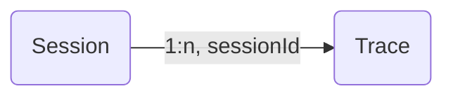

# Sessions

Many interactions with LLM applications span multiple traces. `Sessions` in Langfuse are a way to group these traces together and see a simple **session replay** of the entire interaction. Get started by adding a `sessionId` when creating a trace.



Add a `sessionId` when creating/updating a trace. This can be any string that you use to identify the session. All traces with the same `sessionId` will be grouped together.

<Tabs items={["Python SDK (v3)", "Python SDK (v2)", "JS/TS", "OpenAI (Python)", "Langchain (Python)", "Langchain (JS/TS)", "LlamaIndex (instrumentor)", "LlamaIndex (callback)", "Flowise"]}>

<Tab>
When using the `@observe()` decorator:

```python
from langfuse import observe, get_client

@observe()
def process_request():
    # Get the client
    langfuse = get_client()

    # Add to the current trace
    langfuse.update_current_trace(session_id="your-session-id")

    # ...your processing logic...
    return result
```

When creating spans directly:

```python
from langfuse import get_client

langfuse = get_client()

# You can set the session_id when creating the root span
with langfuse.start_as_current_span(
    name="process-chat-message"
) as root_span:
    # Add session_id to the trace
    root_span.update_trace(session_id="chat-session-123")

    # All spans in this trace will belong to the same session
    with root_span.start_as_current_generation(
        name="generate-response",
        model="gpt-4o"
    ) as gen:
        # ...generate response...
        pass
```

You can also update the session_id of the current trace without a direct reference to a span:

```python
with langfuse.start_as_current_span(name="another-operation"):
    # Add to the current trace
    langfuse.update_current_trace(session_id="your-session-id")
```


</Tab>
<Tab>

When using the [`@observe()` decorator](/docs/sdk/python/decorators):

```python
from langfuse.decorators import langfuse_context, observe

@observe()
def fn():
    langfuse_context.update_current_trace(
        session_id="your-session-id"
    )

fn()
```

When using the [low-level SDK](/docs/sdk/python/low-level-sdk):

```python
from langfuse import Langfuse
langfuse = Langfuse()

trace = langfuse.trace(
    session_id="your-session-id"
)
```

</Tab>
<Tab>

```ts
import { Langfuse } from "langfuse";
const langfuse = new Langfuse();

const trace = langfuse.trace({
  sessionId: "your-session-id",
});
```

See [JS/TS SDK docs](/docs/sdk/typescript/guide) for more details.

</Tab>
<Tab>

**Python SDK v3 - use metadata:**

```python
from langfuse.openai import openai

completion = openai.chat.completions.create(
  name="test-chat",
  model="gpt-3.5-turbo",
  messages=[
    {"role": "system", "content": "You are a calculator."},
    {"role": "user", "content": "1 + 1 = "}],
  temperature=0,
  metadata={"langfuse_session_id": "your-session-id"}
)
```

**Python SDK v2 - pass as additional argument:**

```python
from langfuse.openai import openai

completion = openai.chat.completions.create(
  name="test-chat",
  model="gpt-3.5-turbo",
  messages=[
    {"role": "system", "content": "You are a calculator."},
    {"role": "user", "content": "1 + 1 = "}],
  temperature=0,

  # add session_id as additional argument
  session_id="your-session-id"
)
```

When using the integration with the `@observe()` decorator (see [interop docs](/docs/integrations/openai/get-started#use-traces)), set the session_id via the `langfuse_context`:

```python
from langfuse.decorators import langfuse_context, observe
from langfuse.openai import openai

@observe()
def fn():
    langfuse_context.update_current_trace(
        session_id="your-session-id"
    )

    completion = openai.chat.completions.create(
      name="test-chat",
      model="gpt-3.5-turbo",
      messages=[
        {"role": "system", "content": "You are a calculator."},
        {"role": "user", "content": "1 + 1 = "}],
      temperature=0,
    )

fn()
```

</Tab>
<Tab>

**Python SDK v3 - use metadata in chain invocation:**

```python
from langfuse.langchain import CallbackHandler

handler = CallbackHandler()

# Pass langfuse_session_id as metadata to the chain invocation
chain.invoke(
    {"animal": "dog"},
    config={
        "callbacks": [handler],
        "metadata": {
            "langfuse_session_id": "your-session-id",
        },
    },
)
```

**Python SDK v2 - pass as constructor argument:**

```python
from langfuse.callback import CallbackHandler

handler = CallbackHandler(
  session_id="your-session-id"
)
```

You can also set the `session_id` dynamically via the runnable configuration in the chain invocation:

```python
from langfuse.callback import CallbackHandler

handler = CallbackHandler()

# Pass langfuse_session_id as metadata to the chain invocation to be parsed as the Langfuse session_id
chain.invoke(
    {"animal": "dog"},
    config={
        "callbacks": [handler],
        "metadata": {
            "langfuse_session_id": "your-session-id",
        },
    },
)
```

When using the integration with the `@observe()` decorator (see [interop docs](/docs/integrations/langchain/tracing#interoperability)), set the session_id via the `langfuse_context`:

```python
from langfuse.decorators import langfuse_context, observe

@observe()
def fn():
    langfuse_context.update_current_trace(
        session_id="your-session-id"
    )

    langfuse_handler = langfuse_context.get_current_langchain_handler()

    # Pass handler to invoke of your langchain chain/agent
    chain.invoke({"person": person}, config={"callbacks":[langfuse_handler]})

fn()
```

</Tab>
<Tab>

When using the [CallbackHandler](/docs/integrations/langchain/tracing), you can pass the `sessionId` to the constructor:

```ts
const handler = new CallbackHandler({
  sessionId: "your-session-id",
});
```

You can also set the `session_id` dynamically via the runnable configuration in the chain invocation:

```ts
import { CallbackHandler } from "langfuse-langchain";

const langfuseHandler = new CallbackHandler();

// Your existing Langchain code to create the chain
...

// Pass langfuseSessionId as metadata to the chain invocation to be parsed as the Langfuse session_id
await chain.invoke(
  { input: "<user_input>" },
  { callbacks: [langfuseHandler], metadata: { langfuseSessionId: "your-session-id" } }
);
```

When using the integration with the JS SDK (see [interop docs](/docs/integrations/langchain/tracing#interoperability)), set the sessionId via `langfuse.trace()`:

```ts
import { CallbackHandler, Langfuse } from "langfuse-langchain";
const langfuse = new Langfuse();

const trace = langfuse.trace({
  sessionId: "your-session-id",
});
const langfuseHandler = new CallbackHandler({ root: trace });

// Add Langfuse handler as callback to your langchain chain/agent
await chain.invoke({ input: "<user_input>" }, { callbacks: [langfuseHandler] });
```

</Tab>

<Tab>

<Callout type="info">
The LlamaIndex integration is not supported in the Python SDK v3. Please use a [community-maintained OTEL-based integration](/docs/integrations/llama-index/get-started) instead.
</Callout>

When using the [LlamaIndex Integration](/docs/integrations/llama-index/deprecated/get-started), set the `session_id` via the `instrumentor.observe()` context manager:

```python
from langfuse.llama_index import LlamaIndexInstrumentor

instrumentor = LlamaIndexInstrumentor()

with instrumentor.observe(session_id="my-session"):
    # ... your LlamaIndex index creation ...

    index.as_query_engine().query("What is the capital of France?")

instrumentor.flush()
```

When using the integration with the `@observe()` decorator (see [interop docs](/docs/integrations/llama-index/deprecated/get-started#interoperability-with-langfuse-sdk)), set the session_id via the `langfuse_context`:

```python
from langfuse.decorators import langfuse_context, observe
from langfuse.llama_index import LlamaIndexInstrumentor

instrumentor = LlamaIndexInstrumentor()

@observe()
def llama_index_fn(question: str):
    # Update context
    langfuse_context.update_current_trace(session_id="your-session-id")

    # Get IDs
    current_trace_id = langfuse_context.get_current_trace_id()
    current_observation_id = langfuse_context.get_current_observation_id()

    # Pass to instrumentor
    with instrumentor.observe(
        trace_id=current_trace_id,
        parent_observation_id=current_observation_id,
        update_parent=False
    ) as trace:
        # ... your LlamaIndex index creation ...

        index.as_query_engine().query("What is the capital of France?")

        # Run application
        index = VectorStoreIndex.from_documents([doc1, doc2])
        response = index.as_query_engine().query(question)

        return response
```

</Tab>

<Tab>

<Callout type="info">

The LlamaIndex callback integration is not supported in the Python SDK v3. Please use a community-maintained OTEL-based integration instead.

</Callout>

When using the (deprecated) [LlamaIndex Callback Integration](/docs/integrations/llama-index/deprecated/deprecated-llama-index-callback), set the `session_id` via `set_trace_params`. All LlamaIndex traces created after `set_trace_params` will include the `session_id`. Learn more about `set_trace_params` [here](/docs/integrations/llama-index/deprecated/deprecated-llama-index-callback#set-trace-params).

```python
from llama_index.core import Settings
from llama_index.core.callbacks import CallbackManager
from langfuse import langfuse

# Instantiate a new LlamaIndexCallbackHandler and register it in the LlamaIndex Settings
langfuse_callback_handler = LlamaIndexCallbackHandler()
Settings.callback_manager = CallbackManager([langfuse_callback_handler])

langfuse_callback_handler.set_trace_params(
  session_id="session-abc",
)
```

When using the integration with the `@observe()` decorator (see [interop docs](/docs/integrations/llama-index/deprecated/deprecated-llama-index-callback#interoperability-with-langfuse-sdk)), set the session_id via the `langfuse_context`:

```python
from langfuse.decorators import langfuse_context, observe
from llama_index.core import Document, VectorStoreIndex
from llama_index.core import Settings
from llama_index.core.callbacks import CallbackManager

@observe()
def llama_index_fn(question: str):
    langfuse_context.update_current_trace(
        session_id="your-session-id"
    )

    # Set callback manager for LlamaIndex, will apply to all LlamaIndex executions in this function
    langfuse_handler = langfuse_context.get_current_llama_index_handler()
    Settings.callback_manager = CallbackManager([langfuse_handler])

    # Run application
    index = VectorStoreIndex.from_documents([doc1,doc2])
    response = index.as_query_engine().query(question)
    return response
```

</Tab>

<Tab>
The [Flowise Integration](/docs/flowise) automatically maps the Flowise chatId to the Langfuse sessionId. Flowise 1.4.10 or higher is required.

</Tab>

</Tabs>

## Example

Try this feature using the public [example project](/docs/demo).

_Example session spanning multiple traces_

<Frame border fullWidth>
  
</Frame>

## Other features

- Publish a session to share with others as a public link ([example](https://cloud.langfuse.com/project/clkpwwm0m000gmm094odg11gi/sessions/lf.docs.conversation.TL4KDlo))
- Bookmark a session to easily find it later
- Annotate sessions by adding `scores` via the Langfuse UI to record human-in-the-loop evaluations

## GitHub Discussions

import { GhDiscussionsPreview } from "@/components/gh-discussions/GhDiscussionsPreview";

<GhDiscussionsPreview labels={["feat-sessions"]} />
