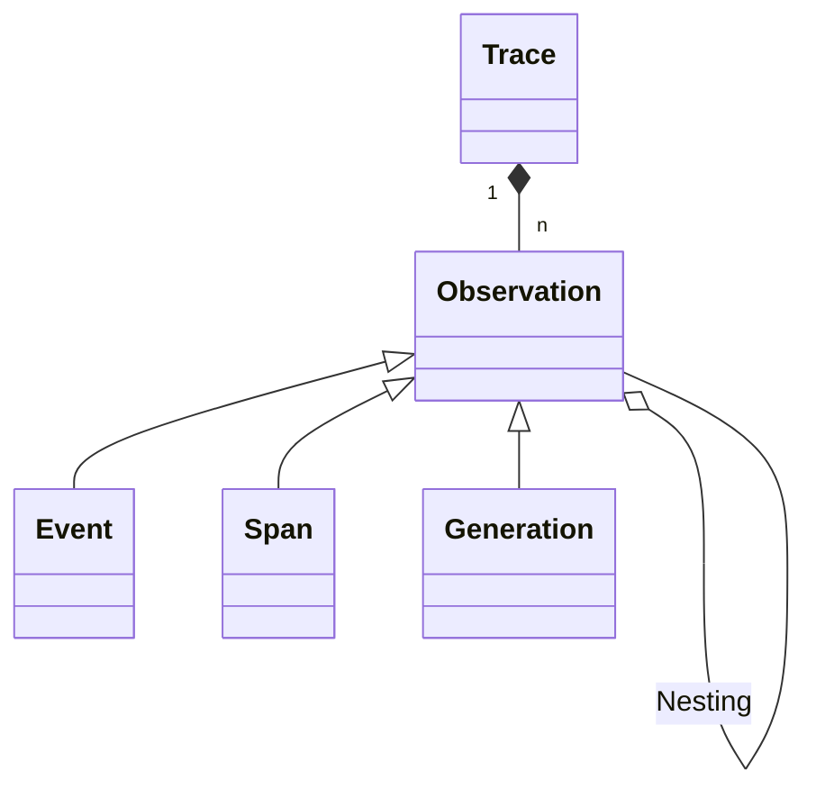

# Tracing

LLM apps use increasingly complex abstractions (chains, agents with tools, advanced prompts). The nested traces in Langfuse help to understand what is going on and get to the root cause of problems.

## Introduction



- Each backend execution is logged with a single `trace`.
- Each trace can contain multiple `observations` to log the individual steps of the execution.
  - Observations are of different types:
    - `Events` are the basic building block. They are used to track discrete events in a trace.
    - `Spans` represent durations of units of work in a trace.
    - `Generations` are spans which are used to log generations of AI models. They contain additional attributes about the model, the prompt/completion. For generations, [token usage](/docs/token-usage) is automatically calculated.
  - Observations can be nested.

Follow the integration docs to send traces to Langfuse. You can use:

- [Langfuse SDKs](/docs/sdk)
- [Langchain integration](/docs/langchain)
- [API](/docs/api)

## Example

Automatically traced with Langchain integration:

<Frame></Frame>

## Detect and fix problems

1. Collect user feedback from the frontend
2. Filter down to executions that had poor quality
3. Use the debugging UI to get to the root cause of the problem

## Share via public link

You can share a trace with anyone via a public link. The link is read-only.

_Example: https://cloud.langfuse.com/public/traces/lf.docs.conversation.u6Wl2hG_

<Frame></Frame>

## Get trace url in SDK

Sometimes, it is useful to get the trace URL directly in the SDK. E.g. to add it to your logs or interactively look at it when running experiments in notebooks.

<Tabs items={["Python", "JS/TS"]}>
<Tab>
```python
# trace object
trace.get_trace_url()
```

```python
# Langchain callback handler
handler.get_trace_url()
```

</Tab>
<Tab>
```typescript
// trace object
trace.getTraceUrl()
```

```typescript
// Langchain callback handler
handler.getTraceUrl();
```

</Tab>

</Tabs>

## Tagging traces

Tagging traces in Langfuse allows you to categorize and filter your traces based on custom criteria. This can be particularly useful when you're dealing with a large number of traces and need to quickly identify specific subsets of them.

To tag a trace, you can simply add a list of tags to the tags field of the trace object. These tags can be any string, and a single trace can have multiple tags.

Here's an example of how to tag a trace in Python and JavaScript:

<Tabs items={["Python", "JS/TS"]}>
<Tab>
```python
trace.tags = ["tag1", "tag2"]
```
</Tab>
<Tab>
```typescript
trace.tags = ["tag1", "tag2"];
```
</Tab>
</Tabs>
Once your traces are tagged, you can use the Langfuse UI to filter your traces based on these tags. This can help you quickly identify and analyze specific subsets of your traces.


