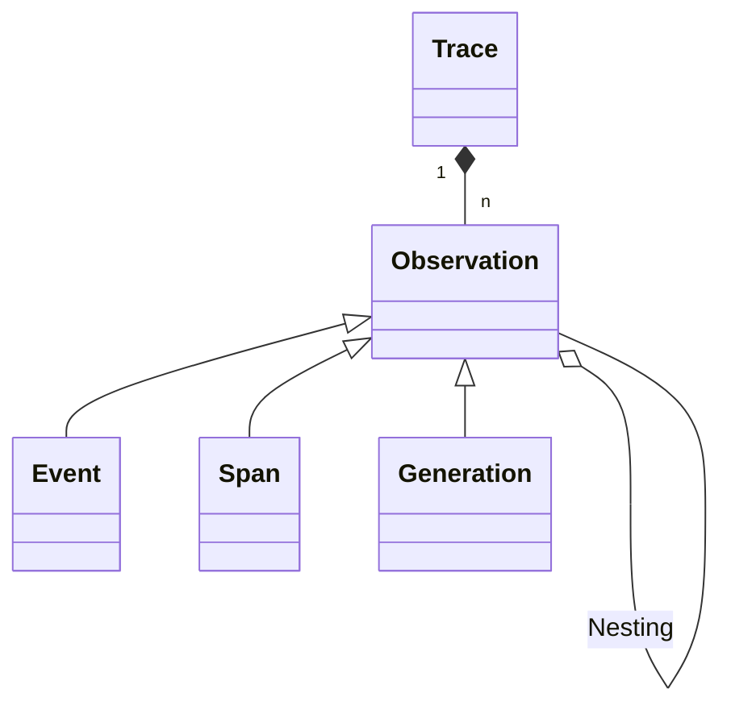

# Tracing

LLM apps use increasingly complex abstractions (chains, agents with tools, advanced prompts). The nested traces in Langfuse help to understand what is going on and get to the root cause of problems.

## Introduction

- Each backend execution is logged with a single `trace`.
- Each trace can contain multiple `observations` to log the individual steps of the execution.
  - Observations are of different types:
    - `Events` are the basic building block. They are used to track discrete events in a trace.
    - `Spans` represent durations of units of work in a trace.
    - `Generations` are spans which are used to log generations of AI models. They contain additional attributes about the model, the prompt/completion. For generations, [token usage and costs](/docs/model-usage-and-cost) are automatically calculated.
  - Observations can be nested.

## Example

Automatically traced with Langchain integration:

<Frame></Frame>

## Detect and fix problems

1. Collect user feedback from the frontend
2. Filter down to executions that had poor quality
3. Use the debugging UI to get to the root cause of the problem
