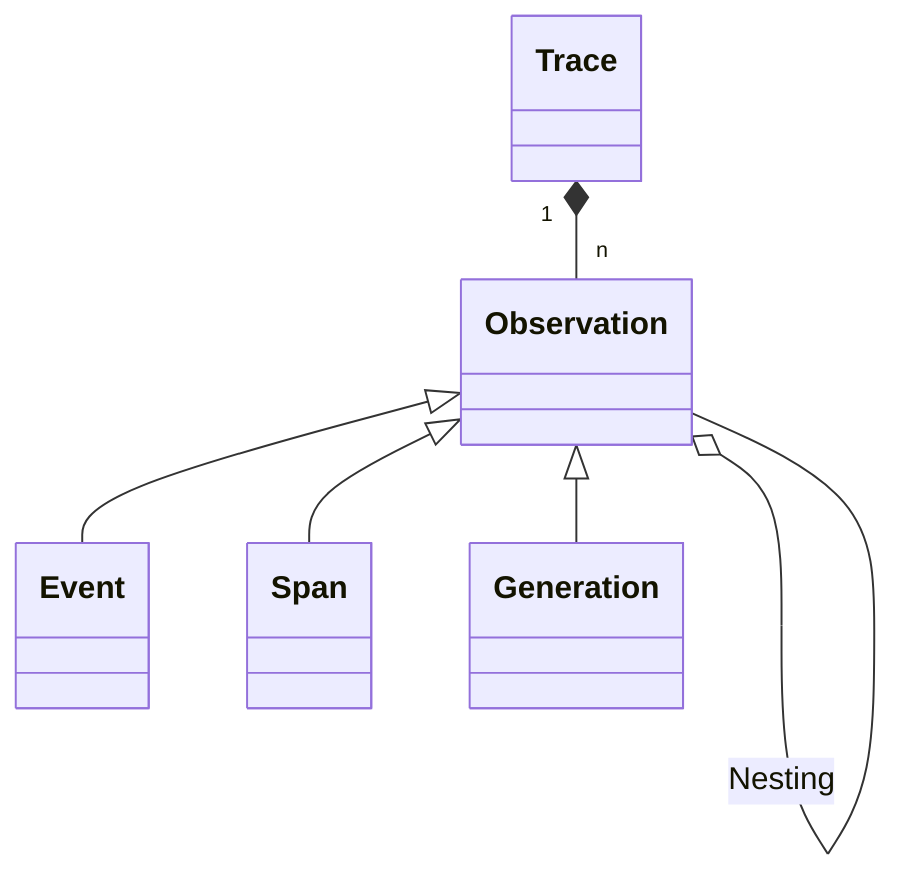

# Tracing

LLM apps use increasingly complex abstractions (chains, agents with tools, advanced prompts). The nested traces in Langfuse help to understand what is going on and get to the root cause of problems.

Why use tracing for your LLM app?

1. Collect user feedback from the frontend
2. Filter down to executions that had poor quality
3. Use the debugging UI to get to the root cause of the problem

## Introduction



A trace in Langfuse consists of the following objects:

- Each backend execution is logged with a single `trace`.
- Each trace can contain multiple `observations` to log the individual steps of the execution.
  - Observations are of different types:
    - `Events` are the basic building block. They are used to track discrete events in a trace.
    - `Spans` represent durations of units of work in a trace.
    - `Generations` are spans which are used to log generations of AI models. They contain additional attributes about the model, the prompt/completion. For generations, [token usage and costs](/docs/model-usage-and-cost) are automatically calculated.
  - Observations can be nested.

## Get Started

Follow the quickstart to add Langfuse tracing to your LLM app.

import { FiCode } from "react-icons/fi";
import { Rocket } from "lucide-react";
import { SiApplearcade } from "react-icons/si";

<Cards num={3}>
  <Card
    icon={<Rocket size="24" />}
    title="Quickstart"
    href="/docs/get-started"
    arrow
  />
  <Card
    icon={<SiApplearcade size="24" />}
    title="Interactive demo"
    href="/docs/demo"
    arrow
  />
</Cards>

## Advanced usage

You can extend the tracing capabilities of Langfuse by using the following features:

import { Users, Tag, MessagesSquare } from "lucide-react";

<Cards num={3}>
  <Card
    title="Sessions"
    href="/docs/tracing/sessions"
    icon={<MessagesSquare />}
    arrow
  />
  <Card title="Users" href="/docs/tracing/users" icon={<Users />} arrow />
  <Card title="Tags" href="/docs/tracing/tags" icon={<Tag />} arrow />
</Cards>

## Event queuing/batching [#queuing-batching]

Langfuse's client SDKs and integrations are all designed to queue and batch requests in the background to optimize API calls and network time. Batches are determined by a combination of time and size (number of events and size of batch).

### Configuration

All integrations have a sensible default configuration, but you can customise the batching behaviour to suit your needs.

| Option (Python)      | Option (JS)          | Description                                              |
| -------------------- | -------------------- | -------------------------------------------------------- |
| `flush_at`           | `flushAt`            | The maximum number of events to batch up before sending. |
| `flush_interval` (s) | `flushInterval` (ms) | The maximum time to wait before sending a batch.         |

You can e.g. set `flushAt=1` to send every event immediately, or `flushInterval=1000` to send every second.

### Manual flushing

import { Callout } from "nextra-theme-docs";

<Callout type="info" emoji="ℹ️">
  This is especially relevant for short-lived applications like serverless
  functions. If you do not flush the client, you may lose events.
</Callout>

If you want to send a batch immediately, you can call the `flush` method on the client. In case of network issues, flush will log an error and retry the batch, it will never throw an exception.

<Tabs items={["Python","JS/TS","OpenAI SDK (Python)","Langchain","Langchain (JS)","LlamaIndex"]}>

<Tab>
{/* Python */}

```python
langfuse.flush()
```

</Tab>
<Tab>
{/* JS/TS */}

```javascript
await langfuse.flushAsync();
```

If you exit the application, use `shutdownAsync` method to make sure all requests are flushed and pending requests are awaited before the process exits.

```javascript
await langfuse.shutdownAsync();
```

</Tab>
<Tab>
{/* OpenAI SDK (Python) */}

```python
openai.flush()
```

</Tab>
<Tab>
{/* Langchain (Python) */}

```python
langfuse_handler.flush()
```

</Tab>
<Tab>
{/* Langchain (JS) */}

```javascript
await langfuseHandler.flushAsync();
```

If you exit the application, use `shutdownAsync` method to make sure all requests are flushed and pending requests are awaited before the process exits.

```javascript
await langfuseHandler.shutdownAsync();
```

</Tab>
<Tab>
{/* LlamaIndex */}

```python
langfuse_handler.flush()
```

</Tab>
</Tabs>
