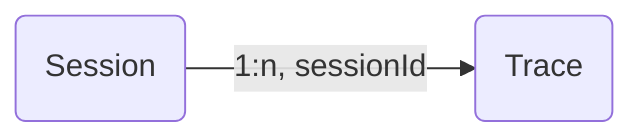

# Sessions

Many interactions with LLM applications span multiple traces. `Sessions` in Langfuse are a way to group these traces together and see a simple **session replay** of the entire interaction. Get started by adding a `sessionId` when creating a trace.



Add a `sessionId` when creating/updating a trace. This can be any string that you use to identify the session. All traces with the same `sessionId` will be grouped together.

<Tabs items={["Python", "JS/TS", "OpenAI", "Langchain (Python)", "Langchain (JS/TS)", "Flowise"]}>
<Tab>

```python
from langfuse import Langfuse
langfuse = Langfuse()

trace = langfuse.trace(
    session_id="your-session-id"
)
```

</Tab>
<Tab>

```typescript
import { Langfuse } from "langfuse";
const langfuse = new Langfuse();

const trace = langfuse.trace({
  sessionId: "your-session-id",
});
```

</Tab>
<Tab>

```python
from langfuse.openai import openai

completion = openai.chat.completions.create(
  name="test-chat",
  model="gpt-3.5-turbo",
  messages=[
    {"role": "system", "content": "You are a calculator."},
    {"role": "user", "content": "1 + 1 = "}],
  temperature=0,

  # add session_id as additional argument
  session_id="your-session-id"
)
```

</Tab>
<Tab>

```python
handler = CallbackHandler(
  session_id="your-session-id"
)
```

</Tab>
<Tab>

```typescript
const handler = new CallbackHandler({
  sessionId: "your-session-id",
});
```

</Tab>

<Tab>
The [Flowise Integration](/docs/flowise) automatically maps the Flowise chatId to the Langfuse sessionId. Flowise 1.4.10 or higher is required.

</Tab>

</Tabs>

## Example

Try this feature using the public [example project](/docs/demo).

_Example session spanning multiple traces_

<Frame border fullWidth>
  
</Frame>

## Other features

- Publish a session to share with others as a public link
- Bookmark a session to easily find it later
- Manually evaluate sessions by adding `scores` from the Langfuse UI
