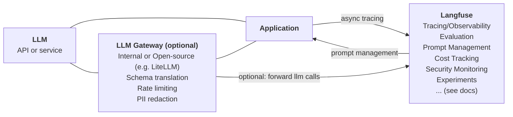

# Langfuse for Enterprise

Langfuse addresses key challenges when deploying LLM-based applications within an enterprise. As an [open source](/open-source) project, Langfuse is the ideal platform **to address data security and privacy concerns by self-hosting.** This document outlines common queries related to using Langfuse in an enterprise setting.

Langfuse is licensed as an open-core project. It's core product (tracing, observability, evals, prompt management and API/SDK endpoints) is MIT-licensed and freely available (also without limitation for commercial use). 

---

## Your platform for enterprise-ready LLM applications

Upgrade to Langfuse Enterprise Edition to address high security requirements and needs of platform teams to support billions of traces per month. With an Enterprise Agreement, you get access to additional support, features to address your specific needs and compliance requirements. 

Please refer to our [feature overview](/pricing-self-host) and the Enterprise Edition FAQ [here](/open-source#enterprise-edition-ee-faq). 

Langfuse is trusted by the best teams building LLM applications and AI agents and supported by the largest open source community:

import { EnterpriseLogos } from "../components/EnterpriseLogos";

<EnterpriseLogos />

---

## Talk to us

Reach out via email ([enterprise@langfuse.com](mailto:enterprise@langfuse.com)) or [talk to us](/talk-to-us) to discuss how Langfuse can best support your team.

---

## Select Resources

- [Why Langfuse?](/why)
- [Langfuse has twice been included in the Thoughtworks Tech Radar](https://www.thoughtworks.com/en-us/radar/platforms/langfuse)
- [Feature Comparison](/pricing-self-host) - Open Source and Enterprise Edition (Self-hosted)
- [Security and Compliance](/security) - includes information on GDPR, HIPAA, SOC2 and ISO27001 compliance
- Langfuse can be procured through the [AWS Marketplace](https://aws.amazon.com/marketplace/seller-profile?id=seller-nmyz7ju7oafxu) or per invoice.

---

## Introduction to Langfuse

_10 minute demo of all Langfuse features_

<iframe
  width="100%"
  className="aspect-[16/9] rounded-lg border w-full mt-5 mb-10"
  src="https://www.youtube-nocookie.com/embed/2E8iTvGo9Hs?si=bT3wbaxdv2DIBCBo"
  title="YouTube video player"
  frameBorder="0"
  allow="accelerometer; autoplay; clipboard-write; encrypted-media; gyroscope; picture-in-picture; web-share"
  referrerPolicy="strict-origin-when-cross-origin"
  allowFullScreen
></iframe>

_Langfuse features along the development lifecycle_

<Frame
  transparent
  fullWidth
  className="mt-5 rounded-lg ring-primary/20 ring-1 dark:hidden"
>
  
</Frame>
<Frame
  transparent
  fullWidth
  className="mt-10 rounded-lg ring-primary/20 ring-1 hidden dark:block"
>
  
</Frame>

---

## Resources

- Product
  - [Scope](/blog/2024-04-introducing-langfuse-2.0) of LLM Engineering Platform
  - [Positioning](/why) of Langfuse
  - [Technical documentation](/docs) with detailed information on all features and integrations
  - [10 minute demo](/watch-demo) of all Langfuse features
  - [Interactive demo](/docs/demo) of the Langfuse platform
  - [Changelog](/changelog)
  - [Roadmap](/docs/roadmap)
  - [Traces as the core of the LLMOps workflow (webinar + slides)](/guides/videos/webinar-observability-llm-systems)
  - [Langfuse has been included in the Thoughtsworks Tech Radar](https://www.thoughtworks.com/en-us/radar/platforms/langfuse)
- Langfuse Cloud
  - [Cloud Pricing](/pricing)
  - [Security and Compliance](/security) - includes information on GDPR, HIPAA, SOC2 and ISO27001 compliance
- Self-hosting
  - [Deployment Guide](/self-hosting)
  - Open Source [Licensing](/open-source)
  - [Comparison](/pricing-self-host) of Open Source and Enterprise version
  - Langfuse Self-Hosting: EE [Terms and Conditions](/terms)

---

## Resellers and managed Langfuse deployments

We [partner](https://www.shakudo.io/partners) with [Shakudo](https://www.shakudo.io/) who operates Langfuse Enterprise self-hosted on behalf of customers on their VPC.

In Japan & APAC, [GAO](https://www.gao-ai.com/) is a partner company based in Tokyo that provides professional services, technical support, and payment in local currency in Japan.

We are happy to introduce prospects to our contact at Shakudo and GAO for more information on self-hosted / managed self-hosting.

---

## FAQ

<Callout type="info" emoji="✨">
  We collect the most common questions and answers here. If you have questions
  that are not answered, please reach out to us: enterprise@langfuse.com
</Callout>

What deployment options are available for Langfuse?

1. Managed Cloud (cloud.langfuse.com), see [Pricing](/pricing) and [Security](/security) page for details.
2. [Self-hosted](/self-hosting) on your own infrastructure. Contact us if you are interested in additional support.

What is the difference between Langfuse Cloud and the open-source version?

The Langfuse team provides Langfuse Cloud as a managed solution to simplify the initial setup of Langfuse and to minimize the operational overhead of maintaining high availability in production. You can chose to self-host Langfuse on your own infrastructure.

Some features are not available in the open-source version. Please refer to the overview [here](/pricing-self-host).

How does Authentication and RBAC work in Langfuse?

Langfuse offers a list of prebuilt roles which apply on an organizational and project level to restrict access ([RBAC documentation](/docs/rbac)).

If needed, environments (production, staging, development) can be separated into different projects in Langfuse to restrict access to production/sensitive data while making it easier to share development environments with the team and other stakeholders.

SSO with Langfuse is simple. Currently Google, GitHub, Azure AD, Okta, Auth0, and AWS Cognito are supported. We can easily add additional providers based on your requirements. As an enterprise customer, you can also enforce SSO for your organization.

What is the easiest way to try Langfuse?

The Hobby Plan on [Langfuse Cloud](https://cloud.langfuse.com) includes enough resources to try Langfuse for free while in a non-production environment, no credit card required.

Alternatively, you can quickly spin up Langfuse on your own machine using `docker compose up` ([docs](/self-hosting/local)).

If you require security and compliance features to run a POC, please reach out to us at enterprise@langfuse.com.

Common Enterprise LLM Platform Architecture

Langfuse aims to address the challenges of debugging, monitoring, and continuously improving LLM-based applications. It focuses on observability, evaluation, and prompt management.

Langfuse is often deployed alongside a central LLM Gateway that provides schema translation, rate limiting, and PII redaction. The LLM Gateway can be an internal service or an open-source project like LiteLLM. If you use LiteLLM, you can leverage the native integration ([docs](/integrations/gateways/litellm)).

---

## Talk to us [#demo]

Reach out via email ([enterprise@langfuse.com](mailto:enterprise@langfuse.com)) or [talk to us](/talk-to-us) to discuss your specific needs and requirements.
