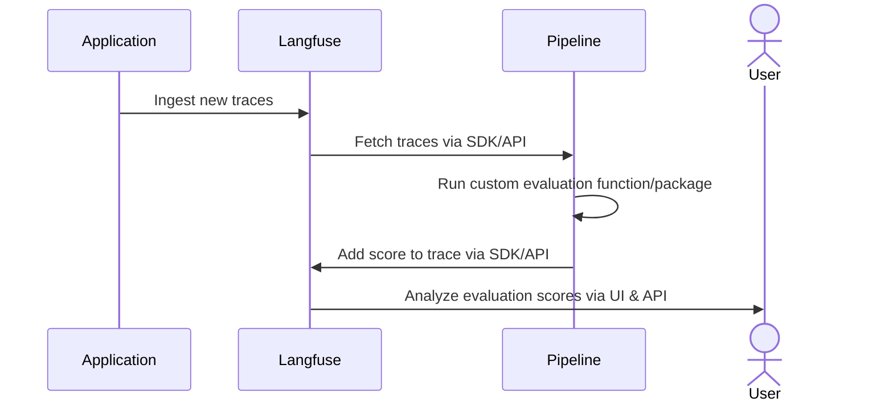

# Evaluate Langfuse LLM Traces with an External Evaluation Pipeline

This cookbook explains how to build an external evaluation pipeline to measure the performance of your production LLM application using Langfuse.

As a rule of thumb, we encourage you to check first if the [evaluations in the Langfuse UI](https://langfuse.com/docs/scores/model-based-evals) cover your use case. If your needs go beyond these, you can still implement in Langfuse custom evaluation templates without code.

Consider implementing an external evaluation pipeline if you need:

- More control over **when** traces get evaluated. You could schedule the pipeline to run at specific times or responding to event-based triggers like Webhooks.
- Greater flexibility with your custom evaluations, when your needs go beyond what’s possible with the Langfuse UI
- Version control for your custom evaluations
- The ability to evaluate data using existing evaluation frameworks

If your use case meets any of this situations, let’s go ahead and implement your first external evaluation pipeline!

<iframe
  width="100%"
  className="aspect-[3230/2160] rounded mt-10"
  src="https://www.youtube-nocookie.com/embed/rHfME8KDmIw?si=V4m8smxZ219AKmOU"
  title="YouTube video player"
  frameborder="0"
  allow="accelerometer; autoplay; clipboard-write; encrypted-media; gyroscope; picture-in-picture; web-share"
  referrerpolicy="strict-origin-when-cross-origin"
  allowFullScreen
></iframe>

---

By the end of this cookbook, you’ll be able to:

- Create a synthetic dataset to test your models.
- Use the Langfuse client to gather and filter traces of previous model runs
- Evaluate these traces offline and incrementally
- Add scores to existing Langfuse traces


Conceptually, we will implement the following architecture:



---

**Note**: While we’re using a Jupyter notebook for this cookbook, in production you'd use your preferred orchestration tool. Just make sure to extract the code into a .py file and ensure all dependencies are available at runtime.


## (Prep-work) Loading synthetic traces to Langfuse

In this demo, we’ll build a mock application: a science communicator LLM that explains any topic in an engaging and approachable way.

Since we don’t have real user data, our first step is to create a synthetic dataset. We’ll generate a variety of potential questions that real users might ask. While this is a great way to kickstart your LLM development, collecting real user queries as soon as possible is invaluable.

You can get your Langfuse API keys [here](https://cloud.langfuse.com/) and OpenAI API key [here](https://platform.openai.com/api-keys)


```python
%pip install langfuse openai deepeval --upgrade
```


```python
import os

# Get keys for your project from the project settings page: https://cloud.langfuse.com
os.environ["LANGFUSE_PUBLIC_KEY"] = "pk-lf-..." 
os.environ["LANGFUSE_SECRET_KEY"] = "sk-lf-..." 
os.environ["LANGFUSE_HOST"] = "https://cloud.langfuse.com" # 🇪🇺 EU region
# os.environ["LANGFUSE_HOST"] = "https://us.cloud.langfuse.com" # 🇺🇸 US region

# Your openai key
os.environ["OPENAI_API_KEY"] = "sk-proj-..."
```

Let's go ahead and generate a list of topic suggestions that we can later query to our application.


```python
import openai

topic_suggestion = """ You're a world-class journalist, specialized
in figuring out which are the topics that excite people the most.
Your task is to give me 50 suggestions for pop-science topics that the general
public would love to read about. Make sure topics don't repeat.
The output must be a comma-separated list. Generate the list and NOTHING else.
The use of numbers is FORBIDDEN.
"""

output = openai.chat.completions.create(
    messages=[
        {
            "role": "user",
            "content": topic_suggestion
        }
    ],
    model="gpt-4o",

    temperature=1
).choices[0].message.content

topics = [item.strip() for item in output.split(",")]
for topic in topics:
    print(topic)
```

Great job! You now have a list of interesting topics users might ask about. Next, let's have our science communicator LLM handle those queries and add the results to Langfuse. To keep things simple, we’ll use Langfuse’s `@observe()` decorator. This decorator automatically monitors all LLM calls (generations) nested in the function. We’re also using the `langfuse` class to label and tag the traces, making it easier to fetch them later.


```python
from langfuse import observe, get_client
langfuse = get_client()

prompt_template = """
You're an expert science communicator, able to explain complex topics in an
approachable manner. Your task is to respond to the questions of users in an
engaging, informative, and friendly way. Stay factual, and refrain from using
jargon. Your answer should be 4 sentences at max.
Remember, keep it ENGAGING and FUN!

Question: {question}
"""

@observe()
def explain_concept(topic):
    langfuse.update_current_trace(
        name=f"Explanation '{topic}'",
        tags=["ext_eval_pipelines"]
    )
    prompt = prompt_template.format(question=topic)


    return openai.chat.completions.create(
        messages=[
            {
                "role": "user",
                "content": prompt,
            }
        ],
        model="gpt-4o-mini",

        temperature=0.6
    ).choices[0].message.content


for topic in topics:
    print(f"Input: Please explain to me {topic.lower()}")
    print(f"Answer: {explain_concept(topic)} \n")
```

Now you should see in the *Traces* section of the langfuse UI the traces you just added.


Remember, the goal of this tutorial is to show you how to build an external evaluation pipeline. These pipelines will run in your CI/CD environment, or be run in a different orchestrated container service. No matter the environment you choose, three key steps always apply:


1.   **Fetch Your Traces**: Get your application traces to your evaluation environment
2.   **Run Your Evaluations**: Apply any evaluation logic you prefer
3.   **Save Your Results**: Attach your evaluations back to the Langfuse trace used for calculating them.

For the rest of the notebook, we'll have one goal:

---

🎯 Goal: ***Every day, at 5 am, our pipeline should evaluate 50 traces from the previous day***

---

## 1. Fetch Your Traces

Fetching traces from Langfuse is straightforward. Just set up the Langfuse client and use one of its functions to fetch the data. We'll take an incremental approach: first, we'll fetch the initial 10 traces and evaluate them. After that, we'll add our scores back into Langfuse and move on to the next batch of 10 traces. We'll keep this cycle going until we've processed a total of 50 traces.

The `fetch_traces()` function has arguments to filter the traces by tags, timestamps, and beyond. We can also choose the number of samples for pagination. You can find more about other methods to [query traces](https://langfuse.com/docs/query-traces) in our docs.


```python
from langfuse import get_client
from datetime import datetime, timedelta

BATCH_SIZE = 10
TOTAL_TRACES = 50

langfuse = get_client()

now = datetime.now()
five_am_today = datetime(now.year, now.month, now.day, 5, 0)
five_am_yesterday = five_am_today - timedelta(days=1)

traces_batch = langfuse.api.trace.list(page=1,
                                     limit=BATCH_SIZE,
                                     tags="ext_eval_pipelines",
                                     from_timestamp=five_am_yesterday,
                                     to_timestamp=datetime.now()
                                   ).data

print(f"Traces in first batch: {len(traces_batch)}")
```

    Traces in first batch: 10


## 2. Run your evaluations

Langfuse can handle numerical, boolean and categorical (`string`) scores.  Wrapping your custom evaluation logic in a function is often a good practice. Evaluation functions should take a `trace` as input and yield a valid score. Let's begin with a simple example using a categorical score.

### 2.1. Categoric Evaluations

When analyzing the outputs of your LLM applications, you may want to evaluate traits that are best defined qualitatively, such as sentiment, tonality or text complexity (Grade level).

We're building a science educator LLM that should sound engaging and positive.
To ensure it hits the right notes, we'll evaluate the tone of its outputs to see if they match our intent. We'll draft an evaluation prompt ourselves (no library) to identify the three main tones in each model output.


```python
template_tone_eval = """
You're an expert in human emotional intelligence. You can identify with ease the
 tone in human-written text. Your task is to identify the tones present in a
 piece of <text/> with precission. Your output is a comma separated list of three
 tones. PRINT THE LIST ALONE, NOTHING ELSE.

<possible_tones>
neutral, confident, joyful, optimistic, friendly, urgent, analytical, respectful
</possible_tones>

<example_1>
Input: Citizen science plays a crucial role in research by involving everyday
people in scientific projects. This collaboration allows researchers to collect
vast amounts of data that would be impossible to gather on their own. Citizen
scientists contribute valuable observations and insights that can lead to new
discoveries and advancements in various fields. By participating in citizen
science projects, individuals can actively contribute to scientific research
and make a meaningful impact on our understanding of the world around us.

Output: respectful,optimistic,confident
</example_1>

<example_2>
Input: Bionics is a field that combines biology and engineering to create
devices that can enhance human abilities. By merging humans and machines,
bionics aims to improve quality of life for individuals with disabilities
or enhance performance for others. These technologies often mimic natural
processes in the body to create seamless integration. Overall, bionics holds
great potential for revolutionizing healthcare and technology in the future.

Output: optimistic,confident,analytical
</example_2>

<example_3>
Input: Social media can have both positive and negative impacts on mental
health. On the positive side, it can help people connect, share experiences,
and find support. However, excessive use of social media can also lead to
feelings of inadequacy, loneliness, and anxiety. It's important to find a
balance and be mindful of how social media affects your mental well-being.
Remember, it's okay to take breaks and prioritize your mental health.

Output: friendly,neutral,respectful
</example_3>

<text>
{text}
</text>
"""


test_tone_score = openai.chat.completions.create(
    messages=[
        {
            "role": "user",
            "content": template_tone_eval.format(
                text=traces_batch[1].output),
        }
    ],
    model="gpt-4o",

    temperature=0
).choices[0].message.content
print(f"User query: {traces_batch[1].input['args'][0]}")
print(f"Model answer: {traces_batch[1].output}")
print(f"Dominant tones: {test_tone_score}")
```

Identifying human intents and tones can be tricky for language models. To handle this, we used a multi-shot prompt, which means giving the model several examples to learn from. Now let's wrap our code in an evaluation function for convenience.


```python
def tone_score(trace):
    return openai.chat.completions.create(
        messages=[
            {
                "role": "user",
                "content": template_tone_eval.format(text=trace.output),
            }
        ],
        model="gpt-4o",
        temperature=0
    ).choices[0].message.content

tone_score(traces_batch[1])
```

Great! Now let's go ahead and create a numeric evaluation score.

### 2.2. Numeric Evaluations

In this cookbook, we'll use the `Deepeval` framework ([docs](https://docs.confident-ai.com/docs/getting-started)) to handle our numeric evaluations. Deepeval provides scores ranging from zero to one for many common LLM metrics. Plus, you can create custom metrics by simply describing them in plain language. To ensure our app's responses are joyful and engaging, we'll define a custom 'joyfulness' score.

You can use any evaluation library. These are popular ones:
- OpenAI Evals ([GitHub](https://github.com/openai/evals))
- Langchain Evaluators
- [RAGAS](https://docs.ragas.io/en/latest/concepts/metrics/index.html) for RAG applications


```python
from deepeval.metrics import GEval
from deepeval.test_case import LLMTestCaseParams, LLMTestCase

def joyfulness_score(trace):
		joyfulness_metric = GEval(
		    name="Correctness",
		    criteria="Determine whether the output is engaging and fun.",
		    evaluation_params=[LLMTestCaseParams.ACTUAL_OUTPUT],
		)
		test_case = LLMTestCase(
    input=trace.input["args"],
    actual_output=trace.output)

		joyfulness_metric.measure(test_case)

		print(f"Score: {joyfulness_metric.score}")
		print(f"Reason: {joyfulness_metric.reason}")

		return {"score": joyfulness_metric.score, "reason": joyfulness_metric.reason}

joyfulness_score(traces_batch[1])
```

Under the hood, GEval uses chain of thought (CoT) prompting to formulate a set of criteria for scoring prompts. When developing your own metrics, it's important to review the reasoning behind these scores. This helps ensure that the model evaluates the traces just as you intended when you wrote the evaluation prompt.

Our eval function returns a dictionary with both the score and the model's reasoning. We do this as we'll persist the reasoning with every langfuse score, ensuring interpretability.

Now we're done with defining our evaluation functions. Let's push those scores back to Langfuse!

## 3. Pushing Scores to Langfuse

Now that we have our evaluation functions ready, it’s time to put them to work. Use the Langfuse client to add scores to existing traces.


```python
langfuse.create_score(
    trace_id=traces_batch[1].id,
    name="tone",
    value=joyfulness_score(traces_batch[1])["score"],
    comment=joyfulness_score(traces_batch[1])["reason"]
)
```

And thus, you've added your first externally-evaluated score to Langfuse! Just 49 more to go 😁. But don't worry — our solutions are easy to scale.

## 4. Putting everything together

Until now, we went through each of the necessary steps to build an external evaluation pipeline: Fetching traces, running the evaluations, and persisting the scores to Langfuse. Let's sum it up into a compact script that you could run in your evaluation pipeline.

We'll fetch the data in batches of 10 traces and then iterate through each trace to score it and push the scores back to Langfuse. Note that this batch size is for demonstration purposes. In a production setup, you might want to process multiple batches in parallel to speed things up. Batching not only reduces the memory load on your system but also allows you to create checkpoints, so you can easily resume if something goes wrong.


```python
import math

for page_number in range(1, math.ceil(TOTAL_TRACES/BATCH_SIZE)):

    traces_batch = langfuse.api.trace.list(
        tags="ext_eval_pipelines",
        page=page_number,
        from_timestamp=five_am_yesterday,
        to_timestamp=five_am_today,
        limit=BATCH_SIZE
    ).data

    for trace in traces_batch:
        print(f"Processing {trace.name}")

        if trace.output is None:
            print(f"Warning: \n Trace {trace.name} had no generated output, \
            it was skipped")
            continue

        langfuse.create_score(
            trace_id=trace.id,
            name="tone",
            value=tone_score(trace)
        )

        jscore = joyfulness_score(trace)
        langfuse.create_score(
            trace_id=trace.id,
            name="joyfulness",
            value=jscore["score"],
            comment=jscore["reason"]
        )

    print(f"Batch {page_number} processed 🚀 \n")
```

If your pipeline ran successfully, you should see your score in the Langfuse UI.


And that's it! You're now ready to integrate these lines into your preferred orchestration tool to ensure they run at the right times.

To achieve our original goal of running the script every day at 5 am, simply schedule a Cron task in your chosen environment with the rule `cron(0 5 * * ? *)`.

Thanks for coding along! I hope you enjoyed the tutorial and found it helpful.
