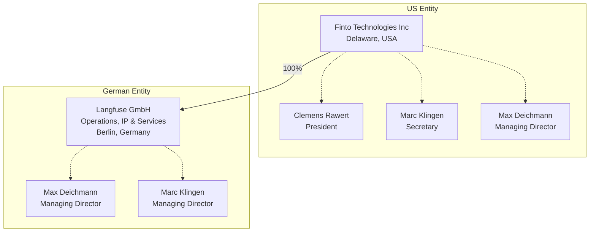

# Entity structure

We have two companies, a parent company in the US (Finto Technologies Inc.) and a 100% owned subsidiary, Langfuse GmbH, in Germany.

For most intents and purposes, Langfuse GmbH is the operating entity. It is the company we use to operate our business, enter into contracts with clients, rent servers etc. Our US entity employs our team in San Francisco, raises funds and oversees our German operating company.

See [imprint](/imprint) for details on both entities.

