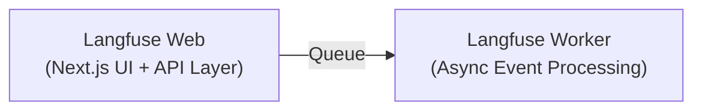
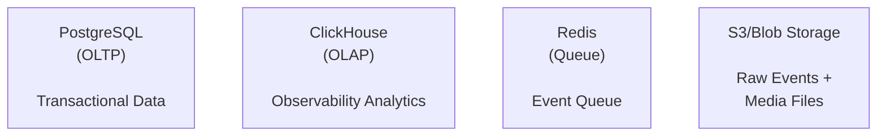
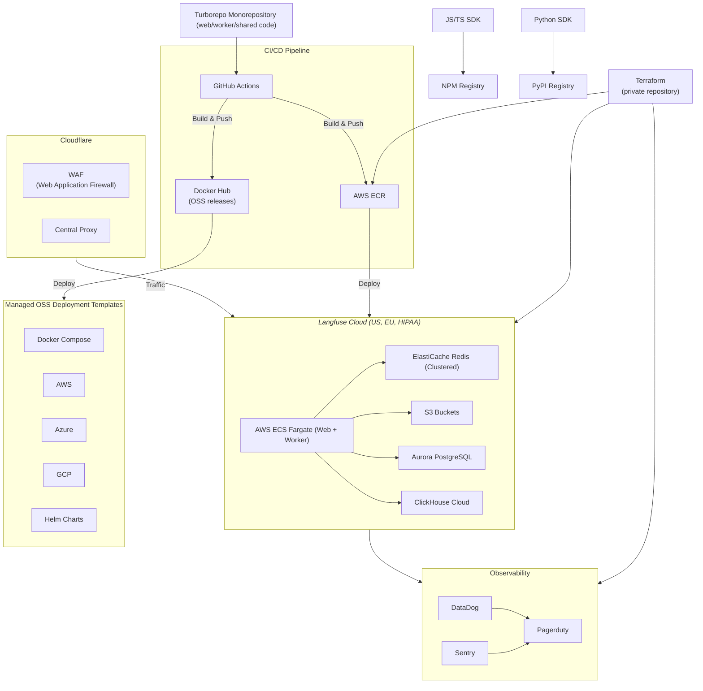

# Langfuse Platform Architecture - High-Level Overview

Langfuse's infrastructure continuously evolves to support increasing scale and new product features. We started on Vercel and Supabase with Next.js and Postgres, and have evolved to the distributed architecture described below. As our product and scale requirements grow, we'll continue to mature our infrastructure to meet those needs.

## Infrastructure Components

### Application Layer

- **Web container (NextJs)**: Serves the UI application and all APIs.
- **Worker container (Express)**: Processes ingestion events in the background and executes async tasks (e.g. exports, LLM as a Judge).

### Storage Layer

- **PostgreSQL**: Stores transactional data (users, organizations, projects, API keys, prompts, datasets, LLM as a Judge settings).
- **ClickHouse**: Stores tracing data (traces, observations, scores). We use it to run dashboards, metrics, and render tables in the UI.
- **Redis**: Stores event queue (BullMQ) and caching layer (API keys, prompts).
- **S3**: Stores raw ingestion events and multi-modal attachments (images, audio).

### Why do we need an OLAP database (Clickhouse) for observability data?
- We built Langfuse initially on Postgres and eventually migrated to Clickhouse. We always knew that Postgres wont be the best fit for our observability data.
- OLAP databases have a columnar layout. With that the database only scans data required to produce results for analytical queries (e.g. LLM cost over time).
- We needed a multi-node database to scale our data insert.
- As we are an open source product, we required a database which runs on an open source license.

---

## Production environments

Our production infrastructure is deployed across multiple AWS regions with a fully automated CI/CD pipeline. All infrastructure is managed using Terraform. Cloudflare WAF (Web Application Firewall) serves as a central proxy in front of AWS, providing DDoS protection, security filtering, and traffic management.

## Data Ingestion from SDKs

<Frame className="">
  
</Frame>

- **SDKs**: SDKs instrument the applications of our users. We built our own Python/JS SDKs which use OpenTelemetry under the hood.
- **API**: SDKs send data to our API, which uploads the data to S3 and queues it for processing by the worker.
- **Redis queue**: Decouples ingestion from processing. We only pass S3 references through Redis.
- **Worker processing**: Asynchronously processes ingestion events, enriches events, flushes to ClickHouse.
- **Dual database**: ClickHouse for analytical queries, Postgres for transactional data
