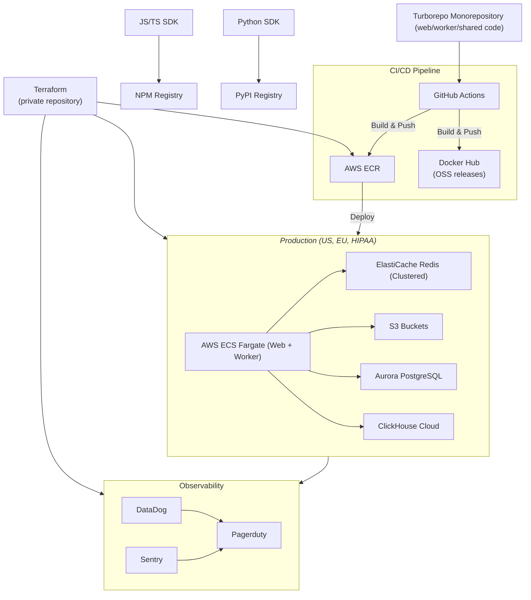

# Langfuse Platform Architecture - High-Level Overview

Langfuse's infrastructure continuously evolves to support increasing scale and new product features. We started on Vercel and Supabase with Next.js and Postgres, and have evolved to the distributed architecture described below. As our product and scale requirements grow, we'll continue to mature our infrastructure to meet those needs.

## Data Flow Through Langfuse

<Frame className="">
  
</Frame>


### Ingestion Pipeline
- **SDKs**: SDKs instrument the applications of our users. We built our own Python/JS SDKs which use OpenTelemetry under the hood.
- **API**: SDKs send data to our API, which uploads the data to S3 and queues it for processing by the worker.
- **Redis queue**: Decouples ingestion from processing. We only pass S3 references through Redis.
- **Worker processing**: Asynchronously processes ingestion events, enriches events, flushes to ClickHouse.
- **Dual database**: ClickHouse for analytical queries, Postgres for transactional data


## Infrastructure Components

### Application Layer
```
┌─────────────────┐         ┌──────────────────┐
│  Langfuse Web   │         │ Langfuse Worker  │
│  (Next.js UI +  │ ──────> │ (Async Event     │
│   API Layer)    │  Queue  │  Processing)     │
└─────────────────┘         └──────────────────┘
```
- **Web container (NextJs)**: Serves the UI application and all APIs.
- **Worker container (Express)**: Processes ingestion events in the background and executes async tasks (e.g. exports, LLM as a Judge).


### Storage Layer
```
┌─────────────┐  ┌─────────────┐  ┌────────────┐  ┌─────────────┐
│ PostgreSQL  │  │ ClickHouse  │  │   Redis    │  │  S3/Blob    │
│  (OLTP)     │  │   (OLAP)    │  │  (Queue)   │  │  Storage    │
└─────────────┘  └─────────────┘  └────────────┘  └─────────────┘
 Transactional    Observability     Event Queue    Raw Events +
 Data             Analytics                        Media Files
```


- **PostgreSQL**: Stores transactional data (users, organizations, projects, API keys, prompts, datasets, LLM as a Judge settings).
- **ClickHouse**: Stores analytical data (traces, observations, scores).
- **Redis**: Stores event queue (BullMQ) and caching layer (API keys, prompts).
- **S3**: Stores raw ingestion events and multi-modal attachments (images, audio).

---


## Production environments

Our production infrastructure is deployed across multiple AWS regions with a fully automated CI/CD pipeline. All infrastructure is managed using Terraform.



