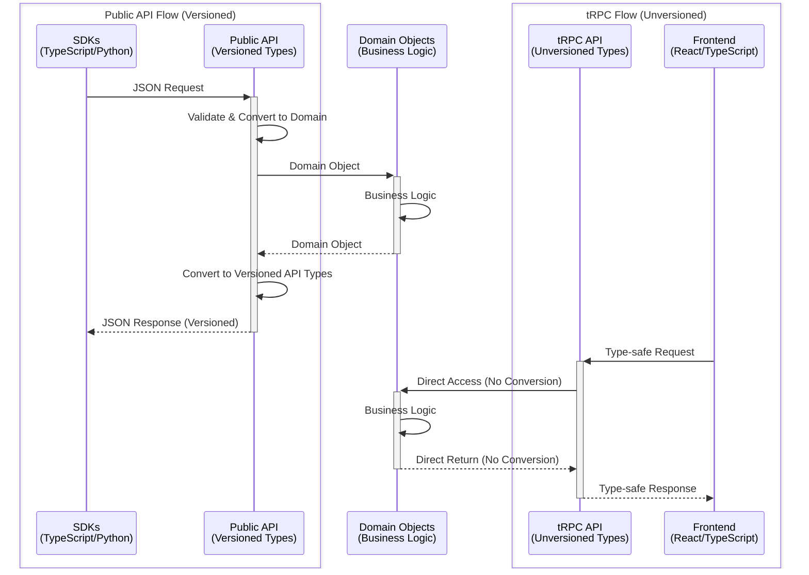
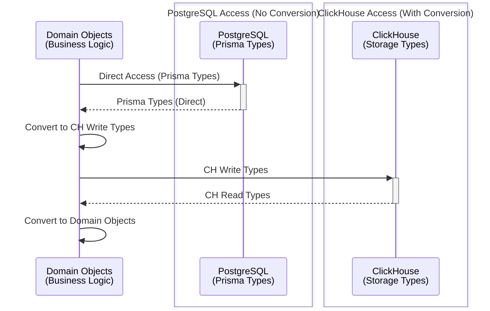

# Backend Code Structure Guide

This guide explains how Langfuse's backend is organized and how to write code that follows our established patterns. 

## Architecture at a Glance

Langfuse uses a **monorepo** structure with three main packages:

- **web** - Next.js 14 application (UI + tRPC API + Public REST API)
- **worker** - Express-based background job processor using BullMQ
- **packages/shared** - Shared code, types, and utilities used by both web and worker

### API Request Flow

```
┌─ Web (NextJs): tRPC API ────┐   ┌── Web (NextJs): Public API ─┐
│                             │   │                             │
│  HTTP Request               │   │  HTTP Request               │
│      ↓                      │   │      ↓                      │
│  tRPC Procedure             │   │  withMiddlewares +          │
│  (protectedProjectProcedure)│   │  createAuthedProjectAPIRoute│
│      ↓                      │   │      ↓                      │
│  Service (business logic)   │   │  Service (business logic)   │
│      ↓                      │   │      ↓                      │
│  Prisma / ClickHouse        │   │  Prisma / ClickHouse        │
│                             │   │                             │
└─────────────────────────────┘   └─────────────────────────────┘
                 ↓
            [optional]: Publish to Redis BullMQ queue
                 ↓
┌─ Worker (Express): BullMQ Queue Job ────────────────────────┐
│                                                             │
│  BullMQ Queue Job                                           │
│      ↓                                                      │
│  Queue Processor (handles job)                              │
│      ↓                                                      │
│  Service (business logic)                                   │
│      ↓                                                      │
│  Prisma / ClickHouse                                        │
│                                                             │
└─────────────────────────────────────────────────────────────┘
```
We follow the layered architecture pattern:
- Router Layer: HTTP Requests or BullMQ Job handlers
- Service Layer: Contains all the business logic
- Repository Layer: Prisma / ClickHouse

## Directory Structure

### Web Package (`/web/src/`)

```
web/src/
├── features/              # Feature-organized code
│   └── [feature-name]/
│       ├── server/        # Backend: tRPC routers, services
│       ├── components/    # Frontend: React components
│       └── types/         # TypeScript types
│
├── server/
│   ├── api/
│   │   ├── routers/       # tRPC routers
│   │   ├── trpc.ts        # tRPC config & middleware
│   │   └── root.ts        # Root router
│   ├── auth.ts            # NextAuth configuration
│   └── db.ts              # Database client
│
├── pages/
│   ├── api/
│   │   ├── public/        # Public REST API endpoints
│   │   └── trpc/          # tRPC handler
│   └── [routes].tsx       # Next.js pages
│
├── __tests__/             # Jest tests
├── instrumentation.ts     # OpenTelemetry setup
└── env.mjs                # Environment config
```

### Worker Package (`/worker/src/`)

```
worker/src/
├── queues/                # BullMQ job processors
│   ├── evalQueue.ts
│   ├── ingestionQueue.ts
│   └── workerManager.ts
├── features/              # Business logic
└── app.ts                 # Express server + queue setup
```

### Shared Package (`/packages/shared/src/`)

```
shared/src/
├── server/                # Server-only code
│   ├── auth/              # Authentication utilities
│   ├── clickhouse/        # ClickHouse client
│   ├── repositories/      # Complex query logic
│   ├── services/          # Shared business logic
│   ├── redis/             # Queue and cache utilities
│   └── instrumentation/   # Observability helpers
│
├── encryption/            # Encryption utilities
├── tableDefinitions/      # Database schemas
├── utils/                 # Shared utilities
├── db.ts                  # Prisma client
└── index.ts               # Public exports
```


## TypeScript Types

We use TypeScript for all our code and maintain a structured type system with clear conversion boundaries.

### Type Hierarchy

Our type system follows a layered architecture with explicit conversions between layers.

#### API Flow Comparison



#### Storage Layer Type Conversions



**Key Differences:**

- **Public APIs are versioned** - Our SDKs convert returned JSON to TypeScript/Python types. We must always be backwards compatible. Hence, we define dedicated types for the public API and convert domain objects to these types.
- **tRPC API is not versioned** - We deploy our backend and frontend in sync and force refresh our frontend on new deployments. Therefore we can introduce breaking changes to the tRPC API.

