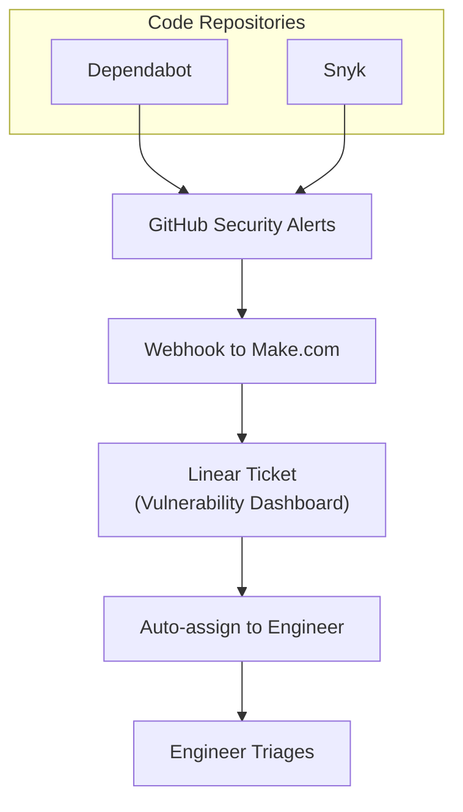

# Vulnerability Handling

We have two different processes for handling security reports. These security reports are always triaged by engineers within 24 hours to act on them promptly if needed.

## Process 1: Manual Security Reports

Security reports sent to `security@langfuse.com` are forwarded to Plain.com (our support tool), where an engineer is auto-assigned to triage and create a Linear ticket.

## Process 2: Automated Vulnerability Detection

All Langfuse repositories have Dependabot and Snyk enabled. Vulnerabilities are automatically reported to GitHub, which sends webhooks to Make.com to create Linear tickets. Automated tickets are auto-assigned to Max.

## 24-Hour Policy

All vulnerabilities must be checked and actioned within 24 hours of detection or report.
