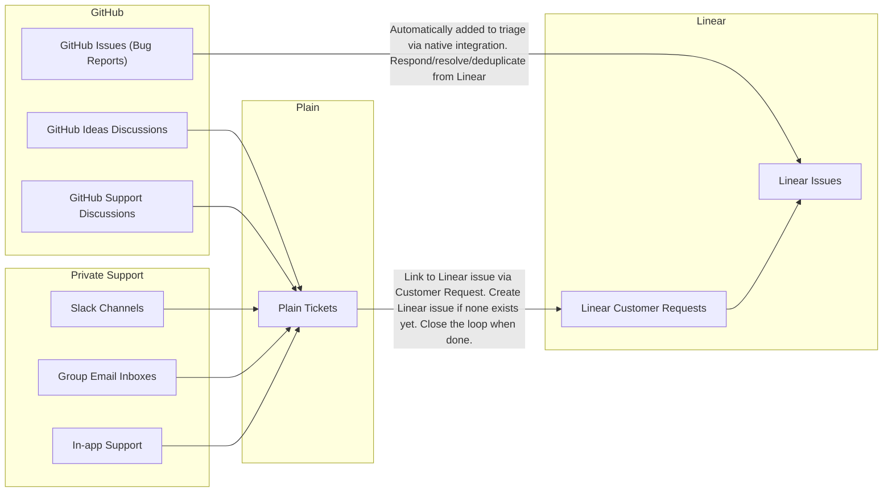

# Product Ops

We maintain an increasingly large product surface area with a small team.
Processes matter in order to fix important bugs fast, and ship highly requested improvements for customers.

## Overview

For product engineering, we use:

- GitHub
  - Issues for bug reports and near term improvements
  - Discussions for feature requests
- Linear for internal ticketing
- Plain for managing support across all channels (in-app, GitHub Discussions Support, Shared Slack Channels, Shared Email inboxes)

We do not use:

- Our individual email inboxes

## Workflow Integration

The following diagram shows how bug reports and feature requests are handled:

