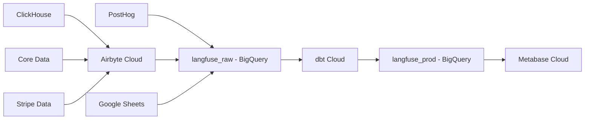

# Analytics

Our internal analytics across teams/functions is based on a central analytics stack.

## Goals

- A maintainable path from raw product data to core business/product metrics. The core business metrics need to be maintainable/testable while underlying systems change.
- If we discuss a metric, it is clearly understood and documented what it means and how it is calculated.

## Data Flow

## Architecture

The Langfuse analytics stack consists of multiple data sources that feed into BigQuery datasets and are then transformed and visualized:

1. **Data Warehouse** -> **BigQuery**

   - [Analytics Project](https://console.cloud.google.com/welcome?inv=1&invt=AbylRQ&project=analytics-461014)

2. **Data Sources** → **langfuse_raw** (BigQuery)

   - [PostHog](https://eu.posthog.com/project/7132) direct export
   - [Airbyte Cloud](https://cloud.airbyte.com/workspaces/c1588c24-d8e8-460a-93ee-cb5987156a60/connections) instance importing:
     - ClickHouse data (from prod-eu, prod-us, prod-hipaa)
     - Core data (from prod-eu, prod-us, prod-hipaa) via S3 exports
     - Stripe data
   - Google Sheets ([main folder](https://drive.google.com/drive/folders/1rFXodaQR81lcRg0QLl-3VF3hYhsJHRmI))
     - Types: domain enrichment
     - Needs to be added to the `langfuse_raw_google_sheets` schema in BigQuery console
     - All sheets in this folder are shared (view only) with the dbt and metabase service accounts

3. **langfuse_raw** → **langfuse_prod** (BigQuery)

   - [dbt Cloud](https://hy094.us1.dbt.com/dashboard/70471823463468/projects/70471823471745/) transforms raw data into production-ready format
   - DBT queries managed in the [Analytics Repo](https://github.com/langfuse/analytics), see Readme for more details on how to use dbt
   - Model layers (mental model):
     - Raw/Core → replicated product data.
     - Staging → region-unified, typed tables (IDs are region-prefixed; timestamps parsed).
     - Marts → business-ready aggregates, e.g. Project Hourly Metrics, Organization Hourly Metrics, Daily/Monthly rollups.

4. **Data Visualization**
   - [Metabase Cloud](https://langfuse.metabaseapp.com/) provides analytical dashboards

### Getting Access

- If you need dbt, Airbyte or BigQuery access to create new metrics, please request it
- You can signup for Metabase with your Langfuse Google account

## Adding a new metric

### "Rules"

- ✅ Put business logic in **dbt**.
- ✅ Build dashboards on **marts** only.
- ❌ Avoid custom SQL on raw tables in Metabase (hard to maintain).
- ✅ Always use a **branch + PR**; **never** push to `main`.
- ✅ Add basic **schema tests** (e.g., `unique`, `not_null`, `accepted_values`) in YAML.

### One-time setup (per person)

- Get access to: BigQuery, dbt Cloud project, [analytics GitHub repo](https://github.com/langfuse/analytics), Metabase.
- Clone the analytics repo; use Cursor/your IDE for dbt development; see analytics repo Readme for more details.

### Standard workflow: add/ship a new metric

1. **Branch:** create feature branch from `main`.
2. **Staging (if needed):** add/extend a staging model that:
   - Unifies regions (EU/US/HIPAA → one table).
   - Ensures **region-prefixed IDs** and parsed timestamps.
   - Add minimal YAML tests (ID `unique`/`not_null`).
3. **Extend Mart:** add the metric to the mart.
   1. Add to .yml of the relevant mart. Start with e.g. project_hourly_metrics which is then rolled up into other marts for organizations or daily adoption metrics.
   2. Use Cursor to generate the SQL and then review.
4. **PR & preview:**
   - Open a PR; dbt Cloud builds/tests **only your diff**.
   - A **temporary BigQuery dataset** tied to your PR is created; validate results there.
5. **Merge:** merge when tests & checks pass. Request review if you are unsure about whether the metrics are correct (value + documentation).
6. **Dashboards:** in Metabase, build/adjust cards **against the marts** (no raw tables).

### Example: Prompt Management usage metric

PR: https://github.com/langfuse/analytics/pull/67 (private analytics repo)

- **What existed:** Each row in the prompts staging table = **one prompt version** (not an update). `created_at` marks the new version.
- **What we wanted:** Metric to track newly created prompt versions per project/org per hour.
- **Change:**
  - **Project Hourly Metrics:** add `count_prompt_versions` = count of prompt versions per project per hour from staging prompts.
  - **Org Hourly Metrics:** sum `count_prompt_versions` over projects.
