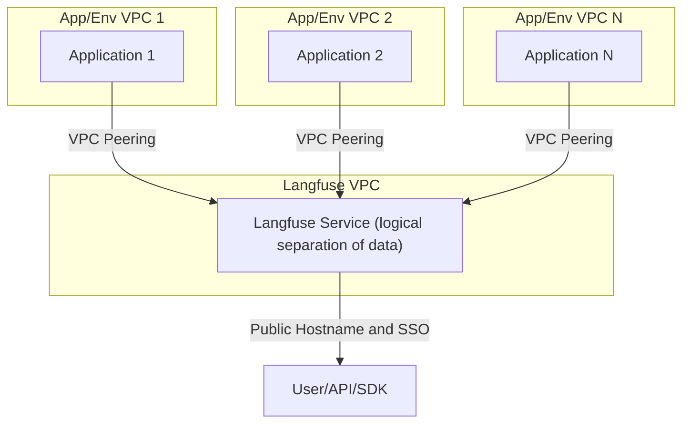
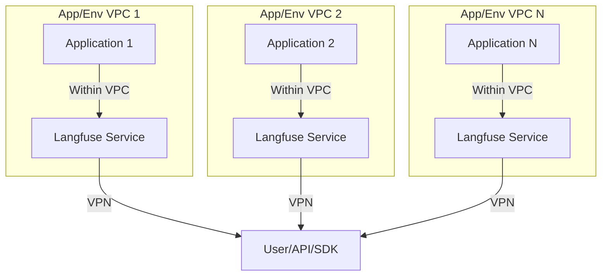

# Deployment Strategies

Use this guide to learn how to manage Langfuse effectively. It covers strategies for handling multiple projects and environments.

When self-hosting Langfuse, there are several strategies you can use to manage projects and environments. This guide outlines the different approaches, their trade-offs, and implementation details to help you decide which strategy best suits your use case.

In most cases, a single Langfuse deployment is the best approach. It leverages RBAC (role-based access control) to separate data by organizations, projects, and user roles. However, certain use cases might require multiple deployments based on specific architectural or organizational needs.

## Single Langfuse Deployment

A single Langfuse deployment is the standard and recommended setup. It centralizes management, scales efficiently across projects and environments, and takes full advantage of Langfuse's built-in RBAC features.

### When to Use

- Your team can rely on Langfuse's RBAC to enforce data isolation.
- You want to minimize infrastructure complexity and operational overhead.

### Implementation Steps

1. Deploy Langfuse following the [self-hosting guide](/self-hosting).
2. Configure organizations and projects for each logical unit (e.g., team, client, or department).
3. Optional: Use [organization creators](/self-hosting/organization-creators) and [project-level RBAC](/docs/rbac) roles to optimize permission management across teams and environments.

### Additional Considerations

- RBAC is critical to ensure proper data isolation. Plan your access control policies carefully.
- Langfuse is designed to be exposed publicly (see networking documentation). This approach simplifies access for stakeholders and eliminates complex network configurations, making it easier to integrate seamlessly across teams and projects.
- VPC peering can be used to access Langfuse privately across projects and environments, enhancing security and connectivity in centralized deployments.

## Langfuse Deployment for Each Service or Project

In this approach, you run a separate Langfuse deployment for each service, project, or environment. This provides complete isolation at the infrastructure level but comes with additional complexity.

Langfuse can be deployed via infrastructure as code (IaC) tools like Terraform or Helm, making this approach more manageable.

### When to Use

- Compliance or regulatory requirements mandate strict data separation.

### Implementation Steps

1. Deploy Langfuse instances for each project or service by following the [self-hosting guide](/self-hosting). For example, you can use a Helm chart to seamlessly integrate Langfuse into your application stack.
2. Use [headless initialization](/self-hosting/headless-initialization) to provision default organizations, projects, and API keys in each Langfuse instance when deploying it together with an application stack.
3. Provision access for users of each individual deployment and educate them about which Langfuse instances are available to them.

### Considerations

- **Higher Costs:** Each deployment requires dedicated resources, including infrastructure, maintenance, and updates.
- **Operational Complexity:** Managing multiple deployments can increase overhead for DevOps teams to scale and continuously [upgrade](/self-hosting/upgrade).
- **More difficult to adopt**: New teams cannot just get started but need to request deployment of an instance for the project or environment.
- **Cross-Project Visibility:** There is no shared view across projects or environments unless you build an external aggregation solution. Separating environments makes prompt deployment across instances more complex. It also makes it harder to sync datasets between production, staging, and development, limiting the ability to test edge cases and learn from production data.
- **Confusion of non-engineering teams:** Non-engineering teams might not understand the difference between Langfuse instances and how to use them.

## Choosing the Right Strategy

| Factor                  | Single Deployment                             | Multiple Deployments                                         |
| ----------------------- | --------------------------------------------- | ------------------------------------------------------------ |
| **Ease of Maintenance** | Centralized and simplified management         | Complex management with higher operational overhead          |
| **Ease of Adoption**    | Quick self-service via project creation in UI | Requires deployment requests and infrastructure provisioning |
| **Cost Efficiency**     | Optimized costs through shared infrastructure | Higher costs from duplicated infrastructure and maintenance  |
| **Data Isolation**      | Project-level isolation through RBAC controls | Complete physical and logical separation between deployments |
| **Scalability**         | Unified scaling of centralized infrastructure | Independent but duplicated scaling for each deployment       |
| **Compliance Needs**    | Suitable for standard compliance requirements | Required for strict regulatory isolation requirements        |
| **User Experience**     | Single interface with seamless project access | Multiple interfaces requiring additional user training       |

### General Recommendation

Start with a single Langfuse deployment and evaluate its scalability and data isolation capabilities. If specific needs arise that require isolated environments, consider moving to a multi-deployment approach for those cases. However, this is usually not recommended.

Please [reach out](/support) in case you have any questions on how to best architect your Langfuse deployment.
