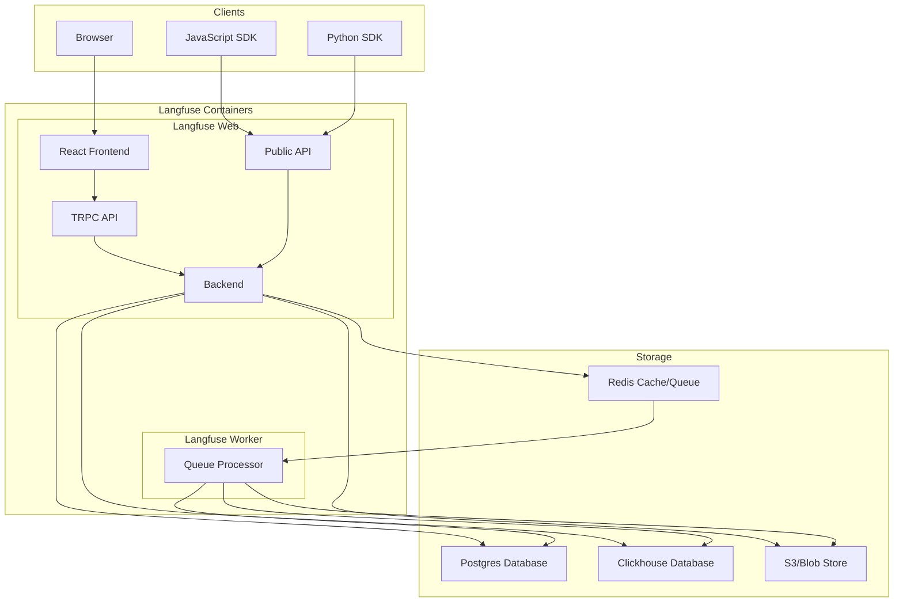

import { Callout } from "nextra/components";

# Self-host Langfuse

<Callout type="info">
  Looking for a managed solution? Consider [Langfuse
  Cloud](https://cloud.langfuse.com) maintained by the Langfuse team.
</Callout>

Langfuse is open source and can be self-hosted using Docker. This section contains guides for different deployment scenarios.

## Deployment Options

Langfuse only depends on open source components and can be deployed locally, on cloud infrastructure, or on-premises. The following options are available:

- Langfuse Cloud: A fully managed version of Langfuse that is hosted and maintained by the Langfuse team.
- Self-host Langfuse: Run Langfuse on your own infrastructure.
  - [Local (Docker Compose)](/docs/deployment/v3/guides/docker-compose)
  - [VM (Docker Compose)](/docs/deployment/v3/guides/docker-compose)
  - [Docker](/docs/deployment/v3/guides/docker)
  - [Kubernetes (Helm)](/docs/deployment/v3/guides/kubernetes-helm)

## Architecture

Langfuse consists of multiple storage components and two Docker containers:

- **Langfuse Web**: The main web application serving the Langfuse UI and APIs.
- **Langfuse Worker**: A worker that asynchronously processes events.
- **Postgres**: The main database for transactional workloads.
- **Redis**: A fast in-memory data structure store. Used for queue and cache operations.
- **S3/Blob Store**: Object storage to persist all incoming events, multi-modal inputs, and large exports.
- **Clickhouse**: High-performance OLAP database which stores traces, observations, and scores.

See the chart below for an overview of the components and their interactions:

### Postgres Database

Langfuse requires a persistent Postgres database to store its state.
You can use a managed service on AWS, Azure, or GCP, or host it yourself.
At least version 12 is required.

### Redis

Langfuse uses Redis for caching and queue operations.
You can use a managed service on AWS, Azure, or GCP, or host it yourself.
At least version 7 is required and the instance must have `maxmemory-policy=noeviction` configured.
You may use Valkey instead of Redis, but there is no active support from the Langfuse team as of now.
See [Redis](/docs/deployment/v3/components/redis) for more details on how to connect Redis to Langfuse.

### S3/Blob Store

Langfuse requires an S3-compatible blob store to persist all incoming events, multi-modal inputs, and large exports.
You can use a managed service on AWS, or GCP, or host it yourself using MinIO.
Langfuse also has experimental support for Azure Blob Storage.
See [S3/Blob Store](/docs/deployment/v3/components/blobstorage) for more details on how to connect a blob store to Langfuse
and more details on Azure Blob Storage.

### Clickhouse

Langfuse uses Clickhouse as an OLAP database to store traces, observations, and scores.
You can use the managed service by Clickhouse Cloud, or host it yourself.
See [ClickHouse](/docs/deployment/v3/components/clickhouse) for more details on how to connect ClickHouse to Langfuse.

## Deployment Guides

The Langfuse team and our community maintain a collection of deployment guides to illustrate how you can run Langfuse in various environments.
This section is work in progress and relies on community contributions.
If you have successfully deployed Langfuse on a specific platform, consider contributing a guide either via a GitHub [PR/Issue](https://github.com/langfuse/langfuse-docs)
or by [reaching out](#contact) to the maintainers.
Please also let us know if one of these guides does not work anymore or if you have a better solution.

- [Docker Compose](/docs/deployment/v3/guides/docker-compose)
- [Kubernetes (Helm)](/docs/deployment/v3/guides/kubernetes-helm)

## Support

If you experience any issues, please join us on [Discord](/discord) or contact the maintainers at support@langfuse.com.

For support with production deployments, the Langfuse team provides dedicated enterprise support. To learn more, reach out to enterprise@langfuse.com or [schedule a demo](/schedule-demo).

Alternatively, you may consider using [Langfuse Cloud](/docs/deployment/cloud), which is a fully managed version of Langfuse. You can find information about its security and privacy [here](/docs/data-security-privacy).

## FAQ

import { FaqPreview } from "@/components/faq/FaqPreview";

<FaqPreview tags={["self-hosting"]} />

## GitHub Discussions

import { GhDiscussionsPreview } from "@/components/gh-discussions/GhDiscussionsPreview";

<GhDiscussionsPreview labels={["self-hosting"]} />
