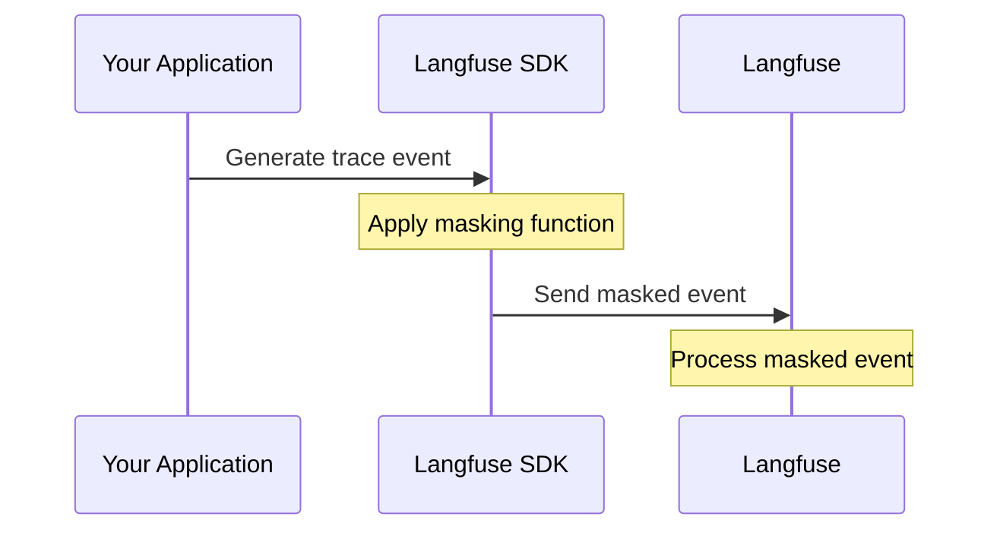
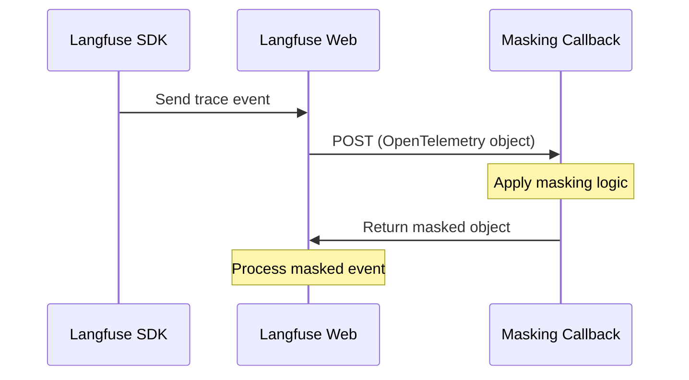

# Data Masking

Masking sensitive data is crucial for **compliance** (GDPR, HIPAA, PCI DSS) and **user privacy** when using LLM observability. Langfuse provides two complementary approaches to data masking:

| Approach                                                           | Description                                  | Best For                                                |
| ------------------------------------------------------------------ | -------------------------------------------- | ------------------------------------------------------- |
| [Client-Side Masking](#client-side-masking)                        | Mask data in the SDK before transmission     | Preventing sensitive data from leaving your application |
| [Server-Side Ingestion Masking](#server-side-ingestion-masking-ee) | Mask data via HTTP callback during ingestion | Centralized policy enforcement across all clients (EE)  |

For maximum security, consider using both approaches together.

## Client-Side Masking

Client-side masking allows you to redact sensitive information directly in your application before data is sent to Langfuse. This ensures sensitive data never leaves your application.



**Key benefits:**

- Data is masked before transmission—sensitive information never reaches Langfuse
- Configured per SDK instance by application developers
- No additional infrastructure required

For comprehensive documentation including code examples, advanced patterns, and integration guides, see the [Client-Side Masking documentation](/docs/observability/features/masking).

---

## Server-Side Ingestion Masking (EE)

<Callout type="info">
  This feature requires an Enterprise license. Please add your [license
  key](/self-hosting/license-key) to activate it.
</Callout>

Server-side ingestion masking allows self-hosted Langfuse administrators to define custom callback logic for masking or redacting sensitive data from tracing events as they are ingested. This feature operates at the Langfuse Web container level, providing centralized data masking across all clients.

**Key benefits:**

- Single point of configuration for all tracing data
- Platform administrator control
- Safety net for data that bypasses client-side masking

### How It Works

1. When a tracing event hits the Langfuse Web container, it checks if a masking callback URL is configured.
2. If configured, Langfuse sends the OpenTelemetry trace object to your callback endpoint via HTTP POST.
3. Your callback service processes the data and returns the masked object.
4. Langfuse continues processing with the masked data.



### Configuration

Configure the masking callback using the following environment variables on the Langfuse Web container:

| Variable                                          | Required / Default | Description                                                                                                                                                                                  |
| ------------------------------------------------- | ------------------ | -------------------------------------------------------------------------------------------------------------------------------------------------------------------------------------------- |
| `LANGFUSE_INGESTION_MASKING_CALLBACK_URL`         | Required to enable | The HTTP(S) URL of your masking callback endpoint. When set, all ingestion events will be sent to this endpoint for masking before processing.                                               |
| `LANGFUSE_INGESTION_MASKING_CALLBACK_TIMEOUT_MS`  | `500`              | Timeout in milliseconds for the callback request. If the callback does not respond within this time, the behavior is determined by the fail mode setting.                                    |
| `LANGFUSE_INGESTION_MASKING_CALLBACK_FAIL_CLOSED` | `true`             | When `true` (default), events are dropped if the callback fails or times out, and a warning is logged. When `false` (fail open), events are processed without masking if the callback fails. |

### Callback Interface

#### Request

Langfuse sends a `POST` request to your callback URL with:

**Headers:**

| Header                  | Description                                          |
| ----------------------- | ---------------------------------------------------- |
| `Content-Type`          | `application/json`                                   |
| `X-Langfuse-Org-Id`     | The organization ID associated with the trace event. |
| `X-Langfuse-Project-Id` | The project ID associated with the trace event.      |

**Body:**

The request body contains the OpenTelemetry trace object in JSON format. This is the raw tracing data that would be stored in Langfuse.

#### Response

Your callback must return:

- **HTTP Status**: `200 OK` for successful masking
- **Body**: The masked OpenTelemetry object in the **exact same schema** as the input

<Callout type="warning">
  The response object must maintain the same structure as the input. Only modify
  the values you want to mask—do not add, remove, or rename fields.
</Callout>

#### Error Handling

Error handling behavior is configured via `LANGFUSE_INGESTION_MASKING_CALLBACK_FAIL_CLOSED`:

| Scenario                | Fail Closed (default)         | Fail Open                                |
| ----------------------- | ----------------------------- | ---------------------------------------- |
| Callback timeout        | Event dropped, warning logged | Event processed unmasked, warning logged |
| HTTP error (4xx, 5xx)   | Event dropped, warning logged | Event processed unmasked, warning logged |
| Invalid response schema | Event dropped, warning logged | Event processed unmasked, warning logged |
| Network error           | Event dropped, warning logged | Event processed unmasked, warning logged |

### Limitations

Server-side ingestion masking only applies to events ingested via the [OpenTelemetry endpoint](/integrations/native/opentelemetry) (`/api/public/otel`). This includes:

- **Python SDK v3+** and **TypeScript SDK v4+** (OTEL-native)
- Third-party OpenTelemetry instrumentation libraries (OpenLLMetry, OpenLIT, etc.)

Events ingested via the legacy `/api/public/ingestion` endpoint are not processed through the masking callback.

### Example Implementation

Here's an example masking callback service in Python using FastAPI:

```python
from fastapi import FastAPI, Request, Header
from typing import Optional
import re

app = FastAPI()

def mask_pii(data):
    """Recursively mask PII in the data structure."""
    if isinstance(data, str):
        # Mask email addresses
        data = re.sub(r'\b[\w.-]+?@\w+?\.\w+?\b', '[REDACTED_EMAIL]', data)
        # Mask phone numbers
        data = re.sub(r'\b\d{3}[-.]?\d{3}[-.]?\d{4}\b', '[REDACTED_PHONE]', data)
        # Mask credit card numbers
        data = re.sub(r'\b\d{4}[-\s]?\d{4}[-\s]?\d{4}[-\s]?\d{4}\b', '[REDACTED_CC]', data)
        return data
    elif isinstance(data, dict):
        return {k: mask_pii(v) for k, v in data.items()}
    elif isinstance(data, list):
        return [mask_pii(item) for item in data]
    return data

@app.post("/mask")
async def mask_trace(
    request: Request,
    x_langfuse_org_id: Optional[str] = Header(None),
    x_langfuse_project_id: Optional[str] = Header(None)
):
    """
    Masking callback endpoint for Langfuse ingestion.

    Receives OpenTelemetry trace objects and returns masked versions.
    """
    body = await request.json()

    # Apply masking logic
    masked_body = mask_pii(body)

    # Optionally, apply different rules based on org/project
    # if x_langfuse_project_id == "specific-project-id":
    #     masked_body = apply_special_masking(masked_body)

    return masked_body
```

Deploy this service and configure Langfuse to use it:

```bash
LANGFUSE_INGESTION_MASKING_CALLBACK_URL=https://your-masking-service.internal/mask
LANGFUSE_INGESTION_MASKING_CALLBACK_TIMEOUT_MS=500
LANGFUSE_INGESTION_MASKING_CALLBACK_FAIL_CLOSED=true
```

### Performance Considerations

- **Latency**: The masking callback adds latency to the ingestion path. Keep your callback service fast (ideally < 100ms).
- **Timeout**: The default 500ms timeout is designed to balance reliability with performance. Adjust based on your masking complexity.
- **Availability**: Your masking service should be highly available, especially with fail-closed mode enabled.
- **Colocation**: Deploy your masking service close to your Langfuse deployment to minimize network latency.

### Troubleshooting

- Events are being dropped unexpectedly
  1. Check that your masking service is responding within the configured timeout.
  2. Verify the response schema matches the input schema exactly.
  3. Review Langfuse Web container logs for warning messages.
  4. Temporarily set `LANGFUSE_INGESTION_MASKING_CALLBACK_FAIL_CLOSED=false` to diagnose issues.
- High latency on trace ingestion
  1. Monitor your masking service response times.
  2. Consider increasing `LANGFUSE_INGESTION_MASKING_CALLBACK_TIMEOUT_MS` if your masking logic requires more time.
  3. Optimize your masking logic or add caching where appropriate.
  4. Ensure network latency between Langfuse and your masking service is minimal.
- Masking not being applied
  1. Verify `LANGFUSE_INGESTION_MASKING_CALLBACK_URL` is correctly set on the Langfuse Web container.
  2. Check that your masking service is reachable from the Langfuse Web container.
  3. Ensure your masking logic is correctly modifying the data and returning it.
