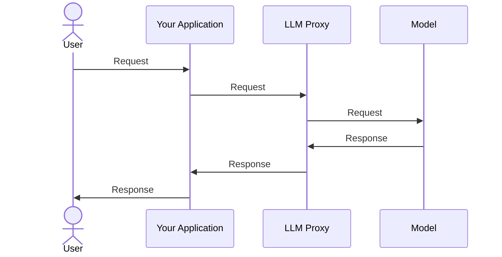
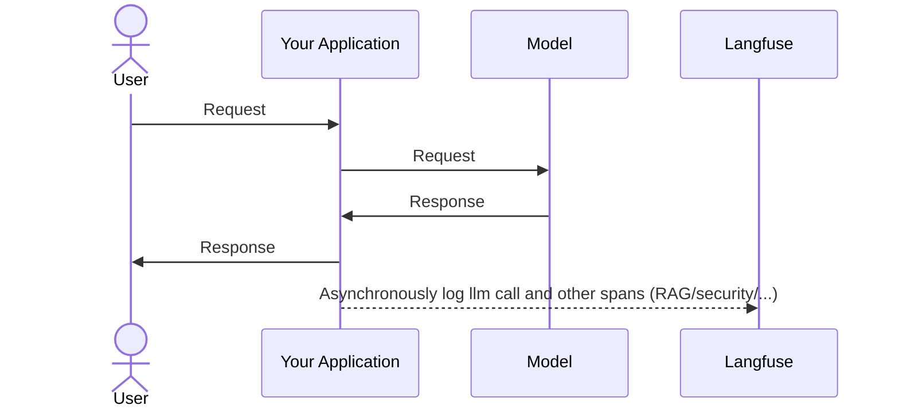

import { BlogHeader } from "@/components/blog/BlogHeader";

<BlogHeader
  title="Should you use an LLM Proxy to Build your Application?"
  description="Learn more about the pros and cons of using an LLM proxy."
  date="September 23, 2024"
  authors={["clemensrawert", "marcklingen"]}
/>

LLM Proxies are popular tools that add much functionality like caching, rate limiting, and routing to making LLM requests. This blog post will explain what a proxy is, what it does well and why ultimately we would recommend to think hard about using a proxy for your application.

## TLDR; Should you use an LLM Proxy?

In most production grade applications, the benefits do not outweigh the risks of using an LLM Proxy and thereby introducing a single point of failure. Thus, we [purposefully](/why) built Langfuse to not act as an LLM Proxy, but rather as an [asynchronous observability layer](/docs/tracing). This comes with the benefit of not limiting what you can observe (also non-LLM related).

Sometimes using a proxy is beneficial (see below); in these cases we recommend using [LiteLLM](https://litellm.ai) which is open-source, can be self-hosted and has a [first-class integration with Langfuse](/integrations/gateways/litellm).

## What is an LLM Proxy?

**An LLM Proxy is a service that sits between your application and the LLM provider's API.** It intercepts the requests and responses, allowing for features like caching, rate limiting, and key management (more below).

## What is an LLM Proxy Useful For?

The great thing about LLM proxies is that they are very **easy to implement**. It usually simply requires changing the Base URL of the LLM provider in the SDK and opens up a range of features:

1. **Caching**: Store and reuse previous LLM responses to reduce API calls, costs and latency.
2. **Rate limiting**: Manage API request rates to avoid exceeding provider limits.
3. **Unified API**: Provide a consistent interface for multiple LLM providers, simplifying integration and provider switching (e.g. call all LLMs in the OpenAI format)
4. **Request routing**: Direct requests to specific model versions or providers based on predefined rules.
5. **Cost management**: Optimize spending by routing requests to cost-effective providers by use case.
6. **Key Management**: Manage API keys and secrets without exposing them to your application.

## What are the Downsides to Using an LLM Proxy?

1. **Latency**: Proxies can introduce additional latency to your application.
2. **Reliability**: Proxies can be a single point of failure in your system.
3. **Security & Privacy**: Proxies can introduce security risks if they are not properly configured.
4. **Client-side timings**: Proxies do not provide client-side timings.

## Is Langfuse an LLM Proxy?

**No, Langfuse is not an LLM Proxy.** Langfuse is an observability layer for your LLM applications that works **asynchronously**. This means that Langfuse does not sit between your application and the LLM provider's API, but rather observes and logs the interactions between your app and the LLM provider 'from the sidelines'.

Operating Langfuse as an asynchronous observability layer offers several advantages over functioning as a proxy:

1. **Full Trace Logging**: Langfuse allows for the logging of [full traces](/docs/tracing), which are crucial for understanding the complete flow of requests and responses in your application. Traces help in identifying bottlenecks, debugging issues, and optimizing performance.
2. **Inclusion of Non-LLM Call Spans**: With Langfuse, you can add spans for non-LLM calls, such as retrieval operations, security screenings, and other auxiliary processes. These operations often have a significant impact on the overall latency and quality of the output, and including them in the trace provides a more comprehensive view of the application's performance.
3. **No Added Latency**: Since Langfuse operates asynchronously, it does not introduce any additional latency to your application's requests. This is a critical advantage, especially for applications where response time is crucial.
4. **No Impact on Uptime**: As an observability layer, Langfuse does not act as a single point of failure. It observes and logs interactions without affecting the uptime of your application, ensuring that your service remains reliable and available.
5. **Client-Side Timings**: Langfuse can capture client-side timings, providing insights into the performance from the user's perspective. This helps in understanding the end-to-end latency and improving the user experience.

## Can I use Langfuse with an LLM Proxy?

You can use Langfuse with LLM proxies. We recommend working with [LiteLLM](https://litellm.ai/) and using their [integration with Langfuse for tracing](/integrations/gateways/litellm).
