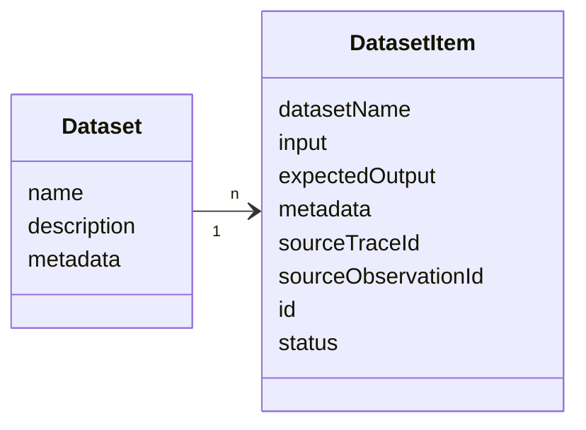
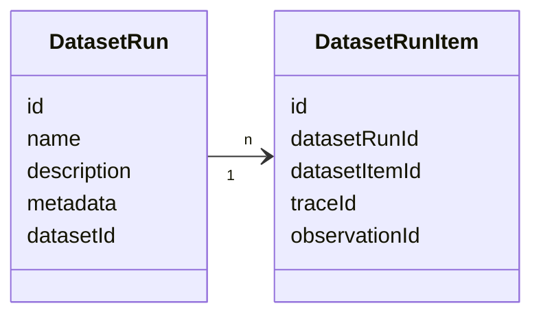
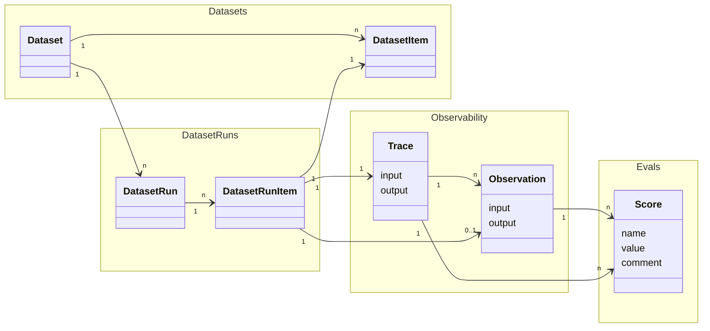

# エクスペリメントのデータモデル

このページでは、Langfuse におけるエクスペリメント関連オブジェクトのデータモデルについて説明します。これらのオブジェクトがどのように連携するかの概要については、[コンセプト](/docs/evaluation/core-concepts) ページを参照してください。スコアとスコア設定オブジェクトについては、[スコアのデータモデル](/docs/evaluation/scores/data-model) を参照してください。

詳細なリファレンスについては、以下を参照してください:

- [Python SDK リファレンス](https://python.reference.langfuse.com)
- [JS/TS SDK リファレンス](https://js.reference.langfuse.com)
- [API リファレンス](https://api.reference.langfuse.com)

## オブジェクト

### データセット (Datasets) [#datasets]

データセットは、データセットラン中に使用できる入力と、オプションで期待される出力のコレクションです。

`Dataset` は `DatasetItem` のコレクションです。

#### Dataset オブジェクト [#dataset-object]

| 属性                      | 型     | 必須 | 説明                                                |
| ------------------------- | ------ | ---- | --------------------------------------------------- |
| `id`                      | string | はい | データセットの一意の識別子                          |
| `name`                    | string | はい | データセットの名前                                  |
| `description`             | string | いいえ | データセットの説明                                  |
| `metadata`                | object | いいえ | データセットの追加メタデータ                        |
| `remoteExperimentUrl`     | string | いいえ | エクスペリメントをトリガーするための Webhook エンドポイント |
| `remoteExperimentPayload` | object | いいえ | エクスペリメントをトリガーするためのペイロード      |

#### DatasetItem オブジェクト [#datasetitem-object]

| 属性                  | 型            | 必須 | 説明                                                                                                                                            |
| --------------------- | ------------- | ---- | ----------------------------------------------------------------------------------------------------------------------------------------------- |
| `id`                  | string        | はい | データセットアイテムの一意の識別子。データセットアイテムは ID で upsert されます。ID は (プロジェクトレベルで) 一意である必要があり、データセット間で再利用できません。 |
| `datasetId`           | string        | はい | このアイテムが所属するデータセットの ID                                                                                                       |
| `input`               | object        | いいえ | データセットアイテムの入力データ                                                                                                                  |
| `expectedOutput`      | object        | いいえ | データセットアイテムの期待される出力データ                                                                                                       |
| `metadata`            | object        | いいえ | データセットアイテムの追加メタデータ                                                                                                              |
| `sourceTraceId`       | string        | いいえ | このデータセットアイテムにリンクするソーストレースの ID                                                                                          |
| `sourceObservationId` | string        | いいえ | このデータセットアイテムにリンクするソースオブザベーションの ID                                                                                  |
| `status`              | DatasetStatus | いいえ | データセットアイテムのステータス。新規作成されたアイテムのデフォルトは ACTIVE。可能な値: `ACTIVE`、`ARCHIVED`                                     |

### DatasetRun (エクスペリメントラン) [#datasetrun-experiment-run]

データセットランは、データセットを LLM アプリケーションに通して実行し、オプションで結果に評価手法を適用するために使用されます。これはしばしばエクスペリメントランと呼ばれます。

 

#### DatasetRun オブジェクト [#datasetrun-object]

| 属性          | 型     | 必須 | 説明                                       |
| ------------- | ------ | ---- | ------------------------------------------ |
| `id`          | string | はい | データセットランの一意の識別子              |
| `name`        | string | はい | データセットランの名前                      |
| `description` | string | いいえ | データセットランの説明                      |
| `metadata`    | object | いいえ | データセットランの追加メタデータ            |
| `datasetId`   | string | はい | このランが所属するデータセットの ID         |

#### DatasetRunItem オブジェクト [#datasetrunitem-object]

| 属性             | 型     | 必須 | 説明                                          |
| --------------- | ------ | ---- | --------------------------------------------- |
| `id`            | string | はい | データセットランアイテムの一意の識別子          |
| `datasetRunId`  | string | はい | このアイテムが所属するデータセットランの ID     |
| `datasetItemId` | string | はい | このランにリンクするデータセットアイテムの ID  |
| `traceId`       | string | はい | このランにリンクするトレースの ID              |
| `observationId` | string | いいえ | このランにリンクするオブザベーションの ID      |

<Callout type="info">
ほとんどの場合、DatasetRunItems が TraceID を直接参照することをお勧めします。ObservationID への参照は、古い SDK バージョンとの後方互換性のために存在します。
</Callout>

### エンドツーエンドのデータ関係 [#end-to-end-data-relations]

エクスペリメントは、いくつかの Langfuse オブジェクトを組み合わせることができます:

- `DatasetRun` (またはエクスペリメントラン) は、`Dataset` のすべての、または選択した `DatasetItem` を LLM アプリケーションでループすることで作成されます。
- LLM アプリケーションに入力として渡される各 `DatasetItem` に対して、`DatasetRunItem` と `Trace` が作成されます。
- オプションで、`DatasetRun` 中の LLM アプリケーションの出力を評価するために、`Trace` に `Score` を追加できます。

 

これらのオブジェクトが概念的にどのように連携するかについては、[コンセプトページ](/docs/evaluation/core-concepts) を参照してください。
トレースとオブザベーションの詳細については、[オブザーバビリティのコアコンセプトページ](/docs/observability/data-model) を参照してください。
スコアとスコア設定オブジェクトの詳細については、[スコアのデータモデル](/docs/evaluation/scores/data-model) を参照してください。

## 関数定義 [#function-definitions]

SDK 経由でエクスペリメントを実行する際は、**task** および **evaluator** 関数を定義します。これらは、エクスペリメントランナーが各データセットアイテムに対して呼び出すユーザー定義関数です。エクスペリメントが概念的にどのように動作するかの詳細は、[コンセプトページ](/docs/evaluation/core-concepts) を参照してください。

### Task [#task]

タスクは、エクスペリメントラン中にデータセットアイテムを受け取って出力を返す関数です。

関数のシグネチャやパラメータについては、SDK リファレンスを参照してください:

- [Python SDK: `TaskFunction`](https://python.reference.langfuse.com/langfuse/experiment#TaskFunction)
- [JS/TS SDK: `ExperimentTask`](https://js.reference.langfuse.com/types/_langfuse_client.ExperimentTask.html)

### Evaluator [#evaluator]

エバリュエーターは、単一のデータセットアイテムに対するタスクの出力をスコアリングする関数です。エバリュエーターは入力、出力、期待される出力、メタデータを受け取り、Langfuse でスコアとなる `Evaluation` オブジェクトを返します。

関数のシグネチャやパラメータについては、SDK リファレンスを参照してください:

- [Python SDK: `EvaluatorFunction`](https://python.reference.langfuse.com/langfuse/experiment#EvaluatorFunction)
- [JS/TS SDK: `Evaluator`](https://js.reference.langfuse.com/types/_langfuse_client.Evaluator.html)

### Run Evaluator [#run-evaluator]

ランエバリュエーターは、エクスペリメント結果全体を評価し、集約メトリクスを計算する関数です。Langfuse データセット上で実行されると、結果のスコアはデータセットランにアタッチされます。

関数のシグネチャやパラメータについては、SDK リファレンスを参照してください:

- [Python SDK: `RunEvaluatorFunction`](https://python.reference.langfuse.com/langfuse/experiment#RunEvaluatorFunction)
- [JS/TS SDK: `RunEvaluator`](https://js.reference.langfuse.com/types/_langfuse_client.RunEvaluator.html)

<Callout type="info">
タスクとエバリュエーターの詳細な使用例については、[SDK 経由のエクスペリメント](/docs/evaluation/experiments/experiments-via-sdk) を参照してください。
</Callout>

## ローカルデータセット [#local-datasets]

現在、[SDK 経由のエクスペリメント](/docs/evaluation/experiments/experiments-via-sdk) を使用してローカルデータセットでエクスペリメントを実行する場合、Langfuse にはトレースのみが作成され、データセットランは生成されません。各タスク実行は、オブザーバビリティとデバッグのために個別のトレースを作成します。

<Callout type="info">

ローカルデータセットに対するエクスペリメントについても、Langfuse データセットと同様の機能 (ラン概要、比較ビューなど) をサポートするための改善をロードマップに掲げています。

</Callout>
